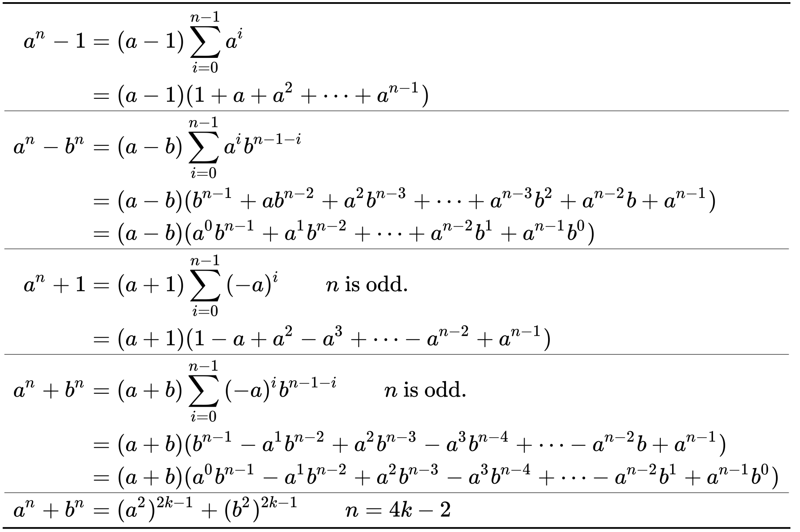

# 第二节 极限

## 极限的概念

> 数列极限存在的充要条件:奇数项和偶数项极限相等为A
> 
> 数列极限是否存在与前有限项无关
> 
> [[1.1函数|函数]]极限x→∞,-∞,+∞.x0
> 
### 1. 数列极限

$\lim\limits_{n \to \infty}x_n=a:\forall \varepsilon >0,\exists N(\varepsilon)>0,当n>N时,有|x_n-a|<\varepsilon$
    
#### 几何意义

对于a点的任何$\varepsilon$领域即开区间($a-\varepsilon$,$a+\varepsilon$),一定存在N,当$n>N$即第N项以后的点$x_n$都落在开区间($a-\varepsilon$,$a+\varepsilon$)内,而只有有限个(最多有N个)在这个区间之外.

- 数列${x_n}$的极限是否存在,如果存在极限值等于多少与数列的前有限项无关
- $\lim\limits_{n\to \infty}x_n=a \Leftrightarrow \lim\limits_{k\to \infty}{x_{2k-1}}=a\Leftrightarrow \lim\limits_{k\to \infty}{x_{2k}}=a$
    
### 2. 函数极限

#### 2.1 自变量趋于无穷大时函数的极限
$$\begin{aligned}
&\lim\limits_{x\to +\infty}f(x)=A :\forall \varepsilon>0,当x>X时,有|f(x)-A|< \varepsilon \\
&\lim\limits_{x\to -\infty}f(x)=A :\forall \varepsilon>0,当x<-X时,有|f(x)-A|< \varepsilon \\
&\lim\limits_{x\to \infty}f(x)=A :\forall \varepsilon>0,当|x|>X时,有|f(x)-A|< \varepsilon \\
\end{aligned}$$

> 在函数极限中$x \to \infty$是指$|x|\to +\infty$,而在数列极限中,$n\to \infty$是指$n\to +\infty$

**定理:** 
$\lim\limits_{x \to \infty}f(x)=A\Leftrightarrow \lim\limits_{x \to +\infty}f(x)=\lim\limits_{x \to -\infty}f(x)=A$

#### 2.2 自变量趋于有限值时函数的极限
1. 极限$\lim\limits_{x\to +\infty}f(x)=A$:$\exists \delta(\varepsilon)>0$,当$0<|x-x_0|<\delta$时,有$|f(x)-A|<\varepsilon$

$\textcolor{red}{注}$ 函数$f(x)$在点$x_{0}$处的极限是否存在,如果存在极限值等于多少仅与$f(x)$在$x_{0}$点的去心领域$\mathring{U}(x_0,\delta)$内的函数值有关,而与$f(x)$在$x_{0}$是否有定义,如果有定义函数值等于多少无关.

2. $\textcolor{green}{左极限}$:$\lim\limits_{x\to x_0^-}f(x)=f(x_0^-)$
3. $\textcolor{green}{右极限}$:$\lim\limits_{x\to x_0^+}f(x)=f(x_0^+)$

**定理:** 
$\lim\limits_{x \to x_0}f(x)=A\Leftrightarrow \lim\limits_{x \to x_0^+}f(x)=\lim\limits_{x \to x_0^-}f(x)=A$

$\textcolor{red}{注}$ 需要分左、右极限求极限的问题主要有三种:

- 分段函数在分界点处的极限,而在该分界点两侧函数表达不同

(这里也包括带有绝对值的函数,如$\lim\limits_{x\to 0}\frac{|x|}{x}$)

- $e^{\infty}$型极限(如$\lim\limits_{x\to 0}e^{\frac{1}{x}},\lim\limits_{x\to \infty }e^{x},\lim\limits_{x\to \infty }e^{-x}$)

$\lim\limits_{x\to 0^-}e^{\frac{1}{x}}=0,\lim\limits_{x\to 0^+}e^{\frac{1}{x}}=+\infty$,则$\lim\limits_{x\to 0}e^{\frac{1}{x}}$不存在,

$\lim\limits_{x\to -\infty }e^{x}=0,\lim\limits_{x\to +\infty }e^{x}=+\infty$,则$\lim\limits_{x\to \infty }e^{x}$不存在

$\textcolor{green}{e^{\infty} \not = \infty ,e^{+\infty} = +\infty,e^{-\infty} = 0}$

- arctan$\infty$型极限(如$\lim\limits_{x\to 0} arctan \frac{1}{x},\lim\limits_{x\to \infty} arctan\ x$)

$\lim\limits_{x\to 0^-}arctan \frac{1}{x}=-\frac{\pi}{2},\lim\limits_{x\to 0^+}arctan \frac{1}{x}=\frac{\pi}{2}$,则$\lim\limits_{x\to 0}arctan \frac{1}{x}$不存在,

$\lim\limits_{x\to -\infty }arctan\ x=-\frac{\pi}{2},\lim\limits_{x\to +\infty }arctan\ x=\frac{\pi}{2}$,则$\lim\limits_{x\to \infty }arctan\ x$不存在

$\textcolor{green}{arctan\ \infty \not= \frac{\pi}{2},arctan\ (+\infty)= \frac{\pi}{2},arctan\ (-\infty)=-\frac{\pi}{2}}$

## 极限的性质
> 数列与函数都对应的极限性质

### 1. 局部有界性
如果数列$\{x_n\}$收敛,那么数列$\{x_n\}$一定$\textcolor{green}{有界}$($\textcolor{red}{必要非充分条件}$),反之不成立.
	
若$\lim\limits_{x\to x_0}f(x)$存在,则$f(x)$在$x_{0}$某去心领域有界(即局部有界),反之不成立.
	
- $x_n=(-1)^n$,有界,不收敛
- 无界数列一定发散
- 发散数列不一定无界
- $sin\frac{1}{x}$在$x=0$处有界,但 $\lim\limits_{x\to 0}sin\frac{1}{x}$不存在 
	
> 某点极限存在,函数在该点去心领域有界
>

### 2. 保号性
> A>0 ⇒ f(x)>0  
> f(x)≥0 ⇒ A≥0  
> 两个反之都不成立  
> 

设$\lim\limits_{x\to x_0}f(x)=A$,则
	
(1)$若A>0(或A<0)\Rightarrow \exists \delta>0,当x \in \mathring{U}(x_0,\delta)时,f(x)>0(或f(x)<0)$
	
(2)$若\exists \delta>0,当x \in \mathring{U}(x_0,\delta)时,f(x)\ge 0(或f(x)\le 0)\Rightarrow A  \ge 0(或A \le 0)$
    
### 3. 保序性

> 可由保号性推出  
> A>B ⇒ f(x) > g(x)  
> f(x) ≥ g(x) ⇒ A≥B  
> 反之都不成立  

设$\lim\limits_{x\to x_0}f(x)=A$,$\lim\limits_{x\to x_0}g(x)=B$,则
	
(1)$若A>B \Rightarrow \exists \delta>0,当x \in \mathring{U}(x_0,\delta)时,f(x)>g(x)$
	
(2)$若\exists \delta>0,当x \in \mathring{U}(x_0,\delta)时,f(x)\ge g(x) \Rightarrow A \ge B$

### 4. 极限值与无穷小之间的关系

$limf(x)=A\Leftrightarrow f(x)=A+\alpha(x),其中lim \alpha(x)=0$

## 极限存在准则

### 1. 夹逼准则

若存在N,当$n>N$时,$x_n \le y_n \le z_n$,且$\lim\limits_{n\to +\infty}x_n=\lim\limits_{n\to +\infty}z_n=a$,则$\lim\limits_{n\to +\infty}y_n=a$

### 2. 单调有界准则   

单调有界数列必有极限.即单调增、有上界的数列必有极限,单调减、有下界的数列必有极限
	
$\textcolor{red}{注}$ 函数极限有对应的以上两条准则.
> - 证存在
> - 一般两边取极限

## 几个重要极限与几个重要的等价无穷小

$$\begin{aligned}
&(1)\lim\limits_{x \to 0}\frac{sinx}{x}=1.推广:\lim\limits_{\varphi(x) \to 0}\frac{sin \varphi(x)}{\varphi(x)}=1,其中\varphi(x) \not= 0\\
&(2)\lim\limits_{x \to 0}(1+x)^{\frac{1}{x}}=e.推广:\lim\limits_{\varphi(x) \to 0}(1+\varphi(x))^{\frac{1}{\varphi(x)}}=e\\
&(3)\lim\limits_{n \to \infty}\sqrt[n]{n}=1, \lim\limits_{n \to \infty}\sqrt[n]{a} = 1(常数a>1)\\
&\lim\limits_{x \to 0^+}x^{\delta}(lnx)^{k}=0,\lim\limits_{x \to 0^+}x^{k}e^{\delta x}=0(常数\delta > 0, k > 0)\\
&(4)当x \to 0 时,\sin x \backsim \tan x \backsim \arctan x \backsim \arcsin x \backsim e^x-1 \backsim ln(1+x) \backsim x, \\
&1-cosx \backsim \frac{1}{2}x^2, (1+x)^a-1 \backsim ax, a^x-1 \backsim xlna (a>0, a \not= 1),\\
&x^m+x^k \backsim x^m (常数k>m>0).
\end{aligned}$$

## 几个重要不等式

$$\begin{aligned} 
&\sin x < x < \tan x,\quad x\in(0,\frac{\pi}{2})\\ 
&\frac{x}{1+x} < \ln (1+x) < x,\quad x\in(0,+∞)\\ 
&x\le e^x -1\le xe^x\\ 
&2ab\le a^2+b^2\\ 
&\sqrt[3]{abc}\leq \frac{a+b+c}{3}\\ &|a-b|\geq \mid |a|-|b|\mid\\ 
&\mid a\pm b\mid \le |a|+|b|\\
& |f(a)|+|f(b)|\le \ 2max(|f(a)|,|f(b)|)
\end{aligned}$$

## 无穷小

### 1. 概念
### 2. 比较
> 分母≠0;分子不恒为0
> 

设$\lim\alpha(x)=0$, $\lim\beta(x)=0$,
- 高阶:若$\lim\frac{\beta(x)}{\alpha(x)}=0$, 记为$\beta(x)=o(\alpha(x))$,
- 同阶:若$\lim\frac{\beta(x)}{\alpha(x)}=C\not=0$,
- 等价:若$\lim\frac{\beta(x)}{\alpha(x)}=1$, 记$\alpha(x) \backsim \beta(x)$,
- 无穷小的阶(K阶):若$\lim\frac{\beta(x)}{[\alpha(x)]^k}=C\not=0$, 称$\beta(x)$是$\alpha(x)$的k阶无穷小,

### 3. 性质
- 有限个无穷小的和仍是无穷小
- 有限个无穷小的积仍是无穷小
- 无穷小量与有界的积仍是无穷小
- 无穷小相加运算法则
	- 设$\alpha(x), \beta(x)$都为$x\to0$的无穷小量,并有$\beta(x)=o(\alpha(x))$, 则$\alpha(x)+\beta(x)\backsim \alpha$,
	- 设$\alpha(x), \beta(x), \gamma(x)$都为$x\to0$的无穷小量,并有$\alpha(x)\backsim a\gamma(x), \beta(x)\backsim b\gamma(x)$, 当$a+b\not=0$时, 则$\alpha(x)+\beta(x)\backsim (a+b)\gamma(x)$,
	 

## 无穷大
> 自变量同一变化过程中,f(x)为无穷大,则其倒数为无穷小  
> f(x)→0,但f(x)≠0,则其倒数是无穷大
>
> 1. 当$x\to+\infty$时,$ln^\alpha x\ll x^\beta \ll a^x$(其中$\alpha >0, \beta >0, a>1$)
> 2. 当$n\to \infty$,$ln^\alpha n\ll n^\beta \ll a^n \ll n! \ll n^n$(其中$\alpha >0, \beta >0, a>1$)
> 
> 数列$\{x_n\}$是无穷大量:$\forall M>0, \exists N, 当n>N时,恒有|x_n|>M$  
> 数列$\{x_n\}$是无界变量:$\forall M>0, \exists N, 使|x_N|>M$  
> 例如:数列$x_n=\left\{\begin{array}{ll}n, n为奇数\\ 0, n为偶数\\\end{array}\right.$ 是无界变量,但不是无穷大.

1. 概念
2. 常用的一些无穷大的比较
3. 无穷大与无界变量的关系    无穷大 ⇒ 无界变量
4. 无穷大与无穷小的关系

## 题型一、极限的概念、性质及存在准则
$\textcolor{red}{注}$  
1. 若$\lim\limits_{n\to \infty}a_n=a$, 则$\lim\limits_{n\to \infty}|a_n|=|a|$, 但反不成立;
2. $\lim\limits_{n\to \infty}a_n=0$的充分必要条件是$\lim\limits_{n\to \infty}|a_n|=0$

## 题型二、求极限

### 方法1  利用有理运算法则求极限
若$\lim f(x)=A, \lim g(x)=B$,则  
- $\lim [f(x)\pm g(x)] = \lim f(x) \pm \lim g(x) = A \pm B$ 
- $\lim [f(x)\cdot g(x)] = \lim f(x) \cdot \lim g(x) = A \cdot B$ 
- $\lim \frac{f(x)}{g(x)} = \frac{\lim f(x)}{\lim g(x)} = \frac{A}{B} \quad (B \not=0)$  

推论:
- 若$\lim f(x)=A\not=0$,则
	- $\lim f(x)g(x)=A \lim g(x)$ 
	- $\lim \frac{g(x)}{f(x)}=\frac{\lim g(x)}{A}$ 
	- 即:极限非零的因子的极限可先求出来
- 若 $\lim \frac{f(x)}{g(x)}$存在,且$\lim g(x)=0$,则$\lim f(x)=0$ 
- 若 $\lim \frac{f(x)}{g(x)}=A\not=0$存在,且$\lim f(x)=0$,则$\lim g(x)=0$ 

$\textcolor{red}{注}$ 
- 若$\lim f(x)$存在,$\lim g(x)$ 不存在,则$\lim [f(x)\pm g(x)]$一定不存在
- 若$\lim f(x)$和$\lim g(x)$ 都不存在,则$\lim [f(x)\pm g(x)]$一定不存在

### 方法2 利用基本极限求极限

$$\begin{aligned}
&\lim\limits_{x\to 0}\frac{\sin x}{x}=1; \qquad \lim\limits_{x\to 0}(1+x)^{\frac{1}{x}}=e; \qquad \lim\limits_{x\to \infty}(1+\frac{1}{x})^{x}=e;\\
&\lim\limits_{x\to 0}\frac{a^x-1}{x}=\ln a \quad(a>0); \qquad \lim\limits_{n\to \infty} \sqrt[n]{n}=1;\\
&\lim\limits_{x\to \infty}\frac{a_nx^n+a_{n-1}x^{n-1}+\cdots+a_1x+a_0}{b_nx^m+a_{m-1}x^{m-1}+\cdots+b_1x+b_0} = 
\left\{\begin{array}{ll}
\frac{a_n}{b_m}, &\quad n=m\\
0, &\quad n < m\\
\infty &\quad n > m\\
\end{array}\right.\\
&\lim\limits_{n\to\infty}x^n=
\left\{\begin{array}{ll}
0, &\quad |x| < 1\\
\infty, &\quad |x| > 1\\
1, &\quad x = 1 \\
不存在,&\quad x = -1
\end{array}\right.; \qquad
\lim\limits_{n\to\infty}e^{nx}=
\left\{\begin{array}{ll}
0, &\quad x < 0\\
+\infty, &\quad x > 0\\
1, &\quad x = 0\\
\end{array}\right. .
\end{aligned}$$

### 方法3 利用等价无穷小代换求极限

> 加减无穷小代换中,A包括0和∞
> > 常用结论
> > $$\begin{aligned} & 1-cos^\alpha x\sim \frac{\alpha}{2}x^2,\qquad x\to0\\ &(1+\alpha(x))^{\beta(x)}-1 \sim \alpha(x)\beta(x),\qquad \alpha(x)\to0,\alpha(x)\beta(x)\to 0\\ \end{aligned}$$
> > 

#### 1. 常用等价无穷小
当$x\to 0$时,  
1. $\sin x \backsim \tan x \backsim \arctan x \backsim \arcsin x \backsim e^x-1 \backsim ln(1+x) \backsim x$  
$(1+x)^{\alpha}-1 \backsim \alpha x, \qquad 1-\cos x \backsim \frac{1}{2}x^2, \qquad a^x-1 \backsim x \ln a$
2. $x-\sin x \backsim \arcsin x-x \backsim \frac{x^3}{6}, \qquad \tan x-x \backsim x-\arctan x \backsim \frac{x^3}{3}$  
$1-\cos x \backsim x-ln(1+x) \backsim \frac{x^2}{2}$

$\textcolor{red}{注}$    	
- 这五个等价无穷小中前3个要记住,后两个可由两个推得.  
事实上由$x-\sin x \backsim \frac{x^3}{6}$得,$\arcsin(\sin x) - \sin x \backsim \frac{x^3}{6} \backsim \frac{\sin^3 x}{6}$,从而有$\arcsin x-x \backsim \frac{x^3}{6}$,同理可由$\tan x-x \backsim \frac{x^3}{3}$推得$x-\arctan x \backsim \frac{x^3}{3}$.  
- 由这几个等价无穷小及等价无穷小的性质(若$\alpha \backsim \beta$,则$\alpha = \beta + o(\beta)$)可得到几个泰勒公式.  
事实上由$\tan x-x \backsim \frac{x^3}{3}$, $\tan x-x = \frac{x^3}{3} + \alpha(x^3)$, 即$\tan x = x + \frac{x^3}{3} + \alpha(x^3)$  
同理可得$\arcsin x=x+\frac{x^3}{6}+o(x^3), \arctan x=x-\frac{x^3}{3}+o(x^3)$

3. 设$\lim  f(x)$ 和$\lim  g(x)$ 在$x=0$的某领域内连续, 且$\lim\limits_{x\to 0}\frac{f(x)}{g(x)}=1$,则$\int_{0}^{x}f(x)dx \backsim \int_{0}^{x}g(x)dx$  
$\textcolor{red}{注}$ 例如当$x\to 0$时,$\ln (1+x^2) \backsim x^2$, 则$\int_{0}^{x}\ln (1+t^2)dt \backsim \int_{0}^{x}t^2dt=\frac{1}{3}x^3$ 

#### 2. 等价无穷小代换的原则
1. 乘、除关系可以换  
若$\alpha \backsim \alpha_1, \beta \backsim \beta_1$, 则$\lim \frac{\alpha}{\beta}=\lim \frac{\alpha_1}{\beta}=\lim \frac{\alpha}{\beta_1}=\lim \frac{\alpha_1}{\beta_1}$
2. 加、减关系在一定条件下可以换
	1. 若$\alpha \backsim \alpha_1, \beta \backsim \beta_1$, 且$\lim \frac{\alpha_1}{\beta_1}=A\not=1$, 则$\alpha-\beta \backsim \alpha_1-\beta_1$
	2. 若$\alpha \backsim \alpha_1, \beta \backsim \beta_1$, 且$\lim \frac{\alpha_1}{\beta_1}=A\not=-1$, 则$\alpha+\beta \backsim \alpha_1+\beta_1$

### 方法4 利用洛必达法则求极限
若 
1. $\lim\limits_{x\to x_0}f(x)=\lim\limits_{x\to x_0}g(x)=0(\infty)$  
2. $f(x)$和$g(x)$在$x_0$的某去心领域内可导, $f'(x), g'(x)$在$\mathring{U}(x_0,\delta)$, 且$g'(x)\not=0$;
3. $\lim\limits_{x\to x_0}\frac{f'(x)}{g'(x)}$存在(或$\infty$)

则, $\lim\limits_{x\to x_0}\frac{f(x)}{g(x)}=\lim\limits_{x\to x_0}\frac{f'(x)}{g'(x)}$

$\textcolor{red}{注}$ 洛必达法则可用来求7种类型不定式的极限,即$\frac{0}{0},\frac{\infty}{\infty},\infty-\infty,0\cdot \infty, 1^{\infty}, \infty^0, 0^0$, 其中前两种$\frac{0}{0},\frac{\infty}{\infty}$直接用洛必达法则,后五种均可化为前两种.

$$\frac{0}{0},\frac{\infty}{\infty}\Leftarrow\left\{\begin{array}{ll}
0\cdot \infty \Leftarrow 
\left\{\begin{array}{ll}
1^{\infty}\\
\infty^0\\
0^0
\end{array}\right.\\
\infty - \infty
\end{array}\right.$$

### 方法5 利用泰勒公式求极限

> 有几个函数可通过其等价无穷小代换来写
> 
> 比如:tanx, arctanx, arcsinx^.
> 

**定理** (带Feano余项的泰勒公式)设$f(x)$在$x=x_0$处n阶可导,则  
$f(x)=f(x_0)+f'(x_0)(x-x_0)+\frac{f''(x_0)}{2!}(x-x_0)^2+\cdots+\frac{f^n(x_0)}{n!}(x-x_0)+o((x-x_0)^n)$  
特别是当$x_0=0$时,  
$f(x)=f(0)+f'(0)(x-x_0)+\frac{f''(0)}{2!}(x-x_0)^2+\cdots+\frac{f^n(0)}{n!}(x-x_0)+o(x^n)$  

几个常用的泰勒公式  
1. $e^x=1+x+\frac{x^2}{2}+\cdots+\frac{x^n}{n!}+o(x^n)$
2. $\sin x=x-\frac{x^3}{3}+\cdots+(-1)^{n-1}\frac{x^{2n-1}}{(2n-1)!}+o(x^{2n-1})$
3. $\sin^2 x=\frac{2x^2}{2!}-\frac{8x^4}{4!}+\frac{32x^6}{6!}\cdots+(-1)^{n-1}\frac{2^{2n-1}x^{2n}}{(2n)!}+o(x^{2n})$
4. $\cos x=1-\frac{x^2}{2}+\cdots+(-1)^{n}\frac{x^{2n}}{(2n)!}+o(x^{2n})$
5. $\ln (x+1)=x-\frac{x^2}{2}+\cdots+(-1)^{n-1}\frac{x^{n}}{n}+o(x^{n})$
6. $\ln (x-1)=-x-\frac{x^2}{2}-\cdots-\frac{x^{n}}{n}+o(x^{n})$
7. $\frac{1}{1+x}=1-x+\cdots+(-x)^n+o(x^{n})$
8. $\frac{1}{1-x}=1+x+\cdots+x^n+o(x^{n})$
9. $(x+1)^\alpha=1+\alpha x+\frac{\alpha(\alpha-1)}{2!}x^2+\cdots+\frac{\alpha(\alpha-1)\cdots(\alpha-n+1)}{n!}x^n+o(x^{n})$

### 方法6 利用夹逼准则求极限

$$\lim_{n\to\infty}\sqrt[n]{a_1^n+a_2^n+\cdots+a_m^n}\ =\ \max_{1\leqslant i\leqslant m}\{a_i\},其中a_i>0(i=1,2,\cdots,m)$$

### 方法7 利用定积分的定义求极限
由定积分定义可知,若将区间[0, 1]n等分,第k个子区间上的$\xi_k$取该子区间右端点,此时$\Delta x_k=\frac{1}{n},\xi_k=\frac{k}{n}$则  
$\int_0^1f(x)dx=\lim\limits_{\lambda\to 0}\sum\limits_{k=1}^n f(\xi_k)\Delta x_k=\lim\limits_{\lambda\to 0}\sum\limits_{k=1}^n f(\frac{k}{n})\cdot \frac{1}{n}=\lim\limits_{\lambda\to 0}\frac{1}{n}\sum\limits_{k=1}^n f(\frac{k}{n})$  
上式右端是一种常见的积分和式的极限.所以,用定积分定义求极限一般方法是:先提"可爱因子"$\frac{1}{n}$, 然后在确定被积函数和积分区间.

1. 利用定积分的定义计算极限的步骤:
	- 每项提出$\frac{b-a}{n}$或$\frac{1}{n}$后,原和式可写成$\sum\limits_{i=1}^n \frac{b-a}{n}f[a+\frac{i(b-a)}{n}]$或$\sum\limits_{i=1}^n \frac{1}{n}f(\frac{i}{n})$
	- 利用定积分的定义,有$\sum\limits_{i=1}^n \frac{b-a}{n}f[a+\frac{i(b-a)}{n}]=\int_a^bf(x)dx$或$\sum\limits_{i=1}^n \frac{1}{n}f(\frac{i}{n})=\int_0^1f(x)dx$
2. 处理n项和极限的三种思路:通过初等变换化简,夹逼定理,定积分
3. 如果要计算的极限是连乘形式的,先对两边取对数化为连加

### 方法8 利用单调有界准则求极限

<aside>
💡 往往先证明极限存在,再两端取极限
</aside>

### 方法9 利用中值定理求极限

1. 拉格朗日中值定理:$f(b)-f(a)=f'(\xi)(b-a)$
2. 积分中值定理:$\int_a^bf(x)dx=f(c)(b-a), \quad a < c < b$
	- $f(x),g(x)在[a,b]上连续,且g(x)不变号,\int_a^bf(x)g(x)dx=f(c)\int_a^bg(x)dx, \quad a < c < b$

例1 如极限$\lim\limits_{n\to \infty}n^2[arctan\frac{a}{n}-arctan\frac{a}{n+1}]=\lim\limits_{n\to \infty}\frac{n^2}{1+\xi^2}(\frac{a}{n}-\frac{a}{n+1})=a$

例2 如函数$f(x)$连续, 且$f(x)\not=0$, 极限$\lim\limits_{x\to 0}\frac{\int_0^x(x-t)f(t)dt}{x\int_0^xf(x-t)dt}=\lim\limits_{x\to 0}\frac{f(\xi)\int_0^x(x-t)dt}{x^2f(x-c)}=\lim\limits_{x\to 0}\frac{x^2-\frac{x^2}{2}}{x^2}=\frac{1}{2}$

---

### 函数的极限(7种)

$$\frac{0}{0}$$
常用方法:
- 洛必达
- 等价无穷小
- 泰勒公式

$\textcolor{red}{注}$ 当$x\to 0$时,$(1+x)^\alpha -1 \backsim \alpha x$,这个结论推广可得,若$\alpha(x)\to 0, \alpha(x)\beta(x)\to 0$,\
则$(1+\alpha(x))^{\beta(x)} -1 \backsim \alpha(x)\beta(x)$ \
如$(1+x)^x -1 \backsim x^2$

$$\frac{∞}{∞}$$
常用方法:
- 洛必达法则
- 分子分母同除以分子和分母各项中最高阶的无穷大

$$∞-∞$$
常用方法:
- 通分化为$\frac{0}{0}$(适用于分式差)
- 根式有理化(适用于根式差)
- 提无穷因子,然后等价代换或变量代换、泰勒公式

$$0•∞$$
常用方法:
- 化为$\frac{0}{0}$
- 化为$\frac{\infty}{\infty}$

$$1^∞$$
常用方法:
- 凑基本极限:$\lim [1+\varphi(x)^{\frac{1}{\varphi(x)}}]=e, 其中\lim \varphi(x)=0(\varphi(x)\not=0)$
- 改写成指数:$\lim [f(x)]^{g(x)}=\lim e^{g(x)\ln f(x)}$ ,用洛必达法则
- 利用结论:若$\lim \alpha(x)=0, \lim \beta(x)=\infty, 且\lim \alpha(x)\beta(x)=A, 则\lim[1+\alpha(x)]^{\beta{x}}=e^A$

归纳为"三部曲"
1. 写标准型:$原式=\lim(1+\alpha)\beta$
2. 求极限:$\lim \alpha\beta=A$
3. 写结果:$原式=e^A$

$$∞^0 和0^0$$
这两种极限的函数一定是幂指函数,即$\lim [f(x)]^{g(x)}$.求解的方法是将其改成指数形式$\lim[f(x)]^{g(x)}=\lim e^{g(x)\ln f(x)}$,从而就化为"$0\cdot\infty$"型极限

### 数列的极限

1. 不定式
    
    > 同函数的不定式,但不能直接用洛必达法则
    > 
    > 需要把数列改写成相应的函数
    > 
2. n项和的数列极限
    
    > 注意夹逼定理与定积分定义可以一起使用
    > 
    > 级数求和也很重要
    > 
    > > 变/主→0, n→∞,变化部分就是次量级,n→∞,变/主=c≠0,则为同量级
    > > 
    > > 当变化部分的最大值与其主体部分相比较是次量级就用夹逼原理
    > > 
    1. 夹逼准则
    2. 定积分定义
    3. 级数求和   
3. n项连乘的数列极限
    1. 夹逼定理
    2. 取对数化n项和
4. **递推关系X1=a,Xn+1=f(Xn)(n=1,2,…)定义的数列**
    
    > 递推函数的导数>0,即递推函数单调增,则数列{Xk}一定单调
    > 
    > 数列不单调,用法2 ,对｜Xn-A｜由保号性、拉格朗日...推导一串递推不定式得,其中A用递推关系A=f(A)替换,｜Xn-A｜≤...≤..→0
    > 

常用方法:  
1. 先证数列$\{x_n\}$收敛(常用单调有界准则),然后令$\lim\limits_{n\to \infty}x_n=A$,等式$x_{n+1}=f(x_n)$两端取极限的$A=f(A)$,由此求得极限A.
2. 先令$\lim\limits_{n\to \infty}x_n=A$,然后等式$x_{n+1}=f(x_n)$两端取极限解得A,得到极限初步结果,最后在证明$\lim\limits_{n\to \infty}x_n=A$

一般来说,当数列$\{x_n\}$具有单调性时用方法1,而当数列${x_n}$不具有单调性或单调性很难判定时用方法2.

单调性判定常用有三种方法:
1. 若$x_{n+1}-x_n \ge 0(\le 0)$,则$\{x_n\}$单调增(单调减)
2. 设$\{x_n\}$不变号,
	1. 若$x_n>0$,则当$\frac{x_{n+1}}{x_n}\ge 1(\le 1)$时,$\{x_n\}$单调增(单调减)
	2. 若$x_n<0$,则当$\frac{x_{n+1}}{x_n}\ge 1(\le 1)$时,$\{x_n\}$单调减(单调增)
3. 设数列$\{x_n\}$由$x_1=a, x_{n+1}=f(x_n)(n=1, 2, \cdots)$,$x_n \in I$所确定
	1. 若$f(x)$在$I$上单调增,则当$x_1\le x_2$时,$\{x_n\}$单调增,当$x_1\ge x_2$时,$\{x_n\}$单调减
	2. 若$f(x)$在$I$上单调减,则$\{x_n\}$不单调.

## 题型三、确定极限式中的参数

## 题型四、无穷小量阶的比较

> 高阶无穷小+低阶无穷小的和阶为低阶,是因为在x变化过程中,高阶无穷小早已变为0,即消去了.
> 
> 两项泰勒展开至某项系数不为0即可
> 
> 偶函数在x=0处的泰勒展开只有偶次项
> 
> 非零常数的阶数为0
> 

由无穷小量阶的定义可知,比较两个无穷小阶的问题就是求$\frac{0}{0}$型极限,所以常用的方法就是求$\frac{0}{0}$型极限的常用三种方法:
1. 洛必达法则(求导定阶)  
若当$x\to 0$时,$f(x)$是无穷小量,且$f'(x)$是$x$的$k(k \ge 0)$阶无穷小,则$f(x)$是$x\to 0$时的$k+1$阶无穷小量
2. 等价无穷小代换  
若当$x\to 0$是$f(x)$是无穷小量,且$f(x)\backsim Ax^k(A\not=0, k>0)$,则$f(x)$是$x\to 0$时的k阶无穷小量  
若当$x\to 0$时,$(1-\cos x)\sin x \backsim \frac{1}{2}x^2$,则当$x\to 0$时,$(1-\cos x)\sin x$是x的3阶无穷小  
3. 泰勒公式

**定阶法** :  
若$f(x)$在$x=0$的某领域内连续,且当$x\to 0$时$f(x)$是$x$的$m$阶无穷小,$\varphi(x)$是$x$的$n$阶无穷小,则当$x\to 0$时$F(x)=\int_0^{\varphi{(x)}}f(t)\mathrm{d}x$是$x$的$n(m+1)$阶无穷小

