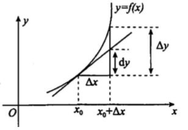
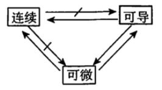
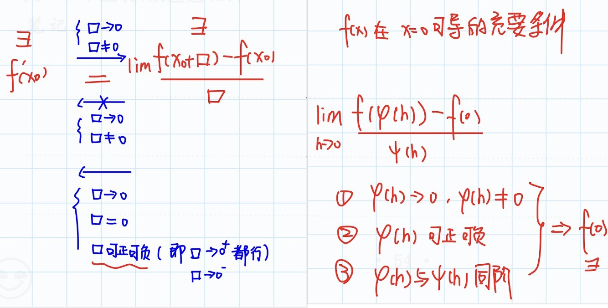

# 第一节 导数与微分

## 导数的概念

**定义（导数）** 设函数$y=f(x)$在$x_{0}$。的某邻域内有定义，如果极限$\lim\limits_{\Delta x\to 0}\frac{\Delta y}{\Delta x}=\lim\limits_{\Delta x\to 0}\frac{f(x_0+\Delta x)-f(x_0)}{\Delta x}$存在，则称$f(x)$在点$x_0$处可导，并称此极限值为$f(x)$在点$x_0$处的导数，记为$f'(x)$或$y'\big|_{x=x_0}$，或$\frac{\mathrm{d}{y}}{\mathrm{d}x}\big|_{x=x_0}$.如果上述极限不存在，则称$f(x)$在点$x_0$处不可导.

$\textcolor{red}{注}$ ：常用的导数定义的等价形式有:
1. $f'(x_0)=\lim\limits_{x\to x_0}\frac{f(x)-f(x_0)}{x-x_0}=\lim\limits_{h\to 0}\frac{f(x_0+h)-f(x_0)}{h}$
2. 左导数：若左极限$\lim\limits_{\Delta x\to 0^-}\frac{\Delta y}{\Delta x}=\lim\limits_{\Delta x\to 0^-}\frac{f(x_0+\Delta x)-f(x_0)}{\Delta x}=\lim\limits_{x\to x_0^-}\frac{f(x)-f(x_0)}{x-x_0}$存在时，则称该极限值为$f(x)$在点$x_0$处的左导数，记为$f'_-(x_0)$.
3. 右导数：若右极限$\lim\limits_{\Delta x\to 0^+}\frac{\Delta y}{\Delta x}=\lim\limits_{\Delta x\to 0^+}\frac{f(x_0+\Delta x)-f(x_0)}{\Delta x}=\lim\limits_{x\to x_0^+}\frac{f(x)-f(x_0)}{x-x_0}$存在时，则称该极限值为$f(x)$在点$x_0$处的右导数，记为$f'_+(x_0)$.

**定理** 可导$\Leftrightarrow$左、右导数都存在且相等.

## 微分的概念

**定义** 若$\Delta y=f(x_0+\Delta x)-f(x_0)=A\Delta x+o(\Delta x)$，其中A为不依赖于$\Delta x$的常数则称函数$f(x)$在点$x_0$处可微，称$A\Delta x$为函数$f(x)$在点$x_0$处相应于自变量增量$\Delta x$的微分,记为$\mathrm{d}y=A\Delta x$.

**定理** 函数$y=f(x)$在点$x_0$处可微的充分必要条件是$f(x)$在点$x_0$处可导，且有$\mathrm{d}y=f'(x_0)\Delta x=f'(x_0)\mathrm{d}x$

## 导数与微分的几何意义

> 导数表示斜率  
> 微分表示用切线上的增量代替曲线上的增量，用均匀代替非均匀的思想。

1. 导数$f'(x_{0})$在几何上表示曲线$y=f(x)$在点$(x_0, f(x_0))$处切线的斜率.  
2. 微分$\mathrm{d}y=f'(x_0)\mathrm{d}x$在几何上表示曲线$y=f(x)$的切线上的增量, $\Delta y=f(x_0+\Delta x)-f(x)$在几何上表示曲线$y=f(x)$上$\Delta y \approx \mathrm{d}y$

## 连续、可导、微分之间的关系

$\textcolor{red}{注}$ 
1. 连续$\nrightarrow$可导，连续$\nrightarrow$可微，经典反例为$f(x)=|x|$
2. $f(x)$可导$\rightarrow f(x)$连续，$f(x)$可导$\nrightarrow f'(x)$连续，$f(x)$可导$\nrightarrow \lim\limits_{x \to x_0}f'(x)$存在，例如
$f(x)\left\{\begin{array}{ll}
x^2\sin \frac{1}{x}, &x \not= 0\\
0, &x=0
\end{array}\right.$
处处可导,但$\lim\limits_{x\to 0}f'(x)$不存在，从而$f'(x)$在$x=0$处也不连续.
3. $f´(x0)$存在「或f(x)可导）」，无法推断出 f(x)的导函数 极限存在和连续。

洛必达法则使用总结

1. f(x) n阶可导，洛必达至多用到其 n-1 阶导函数，然后用导数定义求解。
2. f(x) n阶连续可导，则可用到其 n 阶导函数。

## 求导公式
1. $(C)'=0$
2. $(x^{\alpha})'=\alpha x^{\alpha -1}$
3. $(\alpha^x)'=a^x \ln a, \qquad (e^x)'=e^x$
4. $(\log_a x)'=\frac{1}{x\ln a}, \qquad (\ln|x|)'=\frac{1}{x}$
5. $(\sin x)'= \cos x, \qquad (\cos x)'=-\sin x$
6. $(\tan x)'= \sec^2 x, \qquad (\cot x)'=-\csc^2 x$
7. $(\sec x)'= \sec x \tan x, \qquad (\csc x)'=-\csc x \cot x$
8. $(\arcsin x)'= \frac{1}{\sqrt{1-x^2}}, \qquad (\arccos x)'=-\frac{1}{\sqrt{1-x^2}}$
9. $(\arctan x)'= \frac{1}{1+x^2}, \qquad (\mathrm{arccot} x)'=-\frac{1}{1+x^2}$

## 求导法则

### 1. 有理运算法则
设$u=u(x), v=v(x)$在x处可导，则
1. $(u \pm v)'=u' \pm v'$
2. $(uv)'=u'v \pm uv'$
3. $(\frac{u}{v})'=\frac{u'v-uv'}{v^2} \qquad (v \not= 0)$
 
### 2. 复合函数求导法
设$u=\varphi (x)$在x处可导，$y = f(u)$在对应点处可导，则复合函数$y= f(\varphi (x))$在x处可导，且$\frac{\mathrm{d}y}{\mathrm{d}x}=\frac{\mathrm{d}y}{\mathrm{d}u}\cdot \frac{\mathrm{d}u}{\mathrm{d}x}=f'(u)\varphi '(x)$

### 3. 隐函数求导法
$y=y(x)$是由方程$F(x, y)=0$所确定的可导函数,为求得$y'$,可在方程$F(x, y)=0$两边对x求导，可得到一个含有$y'$的方程，从中解出$y'$即可.

$\textcolor{red}{注}$ $y'$也可由多元函数微分法中的隐函数求导公式$\frac{\mathrm{d}y}{\mathrm{d}x}=-\frac{F'_{x}}{F'_{y}}$得到

### 4. 反函数的导数
若$x=\varphi(y)$在某区间内单调、可导，且$\varphi'(y)\not=0$,则其反函数$y = f()x)$在对应区间内也可导，且$f'(x)=\frac{1}{\varphi'(x)}$或$\frac{\mathrm{d}y}{\mathrm{d}x}=\frac{1}{\frac{\mathrm{d}x}{\mathrm{d}y}}$

### 5. 参数方程求导法（数三不要求）
设$y = y(x)$是由参数方程$\left\{\begin{array}{ll}
x=\varphi(t)\\y=\psi(t)
\end{array}\right.(\alpha < t < \beta)$确定的函数，则
1. 若$\varphi(t)$和$\psi(t)$都可导，且$\varphi'(t)\not=0$，则$\frac{\mathrm{d}y}{\mathrm{d}x}=\frac{\psi'(t)}{\varphi'(t)}$
2. 若$\varphi(t)$和$\psi(t)$二阶可导，且$\varphi'(t)\not= 0$，则$\frac{\mathrm{d}^2y}{\mathrm{d}x^2}=\frac{\mathrm{d}\frac{\psi'(t)}{\varphi'(t)}}{\mathrm{d}t}\cdot \frac{1}{\varphi'(t)}=\frac{\psi''(t)\varphi'(t)-\psi'(t)\varphi''(t)}{\varphi'^3(t)}$

### 6. 对数求导法
如果$y=y(x)$的表达式由多个因式的乘除、乘幂构成,或是幂指函数的形式，则可先将函数取对数,然后两边对x求导.

### 7. 高阶导数
1. 定义：$f^{(n)}(x_0)=\lim\limits_{\Delta x\to 0}\frac{f^{(n-1)}(x_0+\Delta x)-f^{(n-1)}(x_0)}{\Delta x}=\lim\limits_{x\to x_0}\frac{f^{(n-1)}(x)-f^{(n-1)}(x_0)}{x-x_0}$
2. 常用公式：  
	a. $(\sin x)^{(n)}=\sin(x+\frac{n\pi}{2})$  
	b. $(\cos x)^{(n)}=\cos(x+\frac{n\pi}{2})$  
	c. $(u\pm v)^{(n)}=u^{(n)}\pm v^{(n)}$  
	d. $(uv)^{(n)}=\sum\limits_{k=0}^nC_n^k u^{(k)}v^{(n-k)}$  
	e. $(e^x)^{(n)}=e^x$  
	f. $(x^n)^{(n)}=n!\qquad (x^n)^{(n+1)}=0 \qquad (x^u)^{(n)}=u(u-1)\cdots (u-n+1)x^{u-n}$   
	g. $(\frac{1}{x})^{(n)}=(-1)^n\frac{n!}{x^(n+1)}$  
	h. $[\ln(1+x)]^{(n)}=(-1)^{n-1}(n-1)!(x+1)^{-n}$

## 题型一、导数与微分的概念
1. 利用导数定义求极限
2. 利用导数定义求导数
3. 利用导数定义判断函效的可导性

（1）$f´(x0)=A$ (or 存在)，凑导数定义  
（2）归纳导数定义求导数的3个条件  
（3）归纳函数可导的充要条件

$$\begin{aligned} & 设 f(x) = g(x)·| x - a |，
其 g(x) 在 x = a 处连续，
\\&则 f(x) 在 x = a 处可导的充要条件是 g(a) = 0 \end{aligned}$$

### **函数 f(x) 和 | f(x) | 可导性之间的关系归纳如下**

> 第2点可联想几何图形来简易证明
> 
1. $f(x)$可导$\nLeftrightarrow |f(x)|$可导, 反例分别是$f(x)=x$和$f(x)=\left\{\begin{array}{ll}
-1,\quad &x<0\\
1, \quad &x\ge 0
\end{array}\right.$
2. 设$f(x)$连续，  
若$f(x_0)\not=0$, 则$f(x)$在$x_0$处可导$\Leftrightarrow |f(x)|$在$x_0$处可导  
若$f(x_0)=0$, 则$f'(x_0)=0\Leftrightarrow |f(x)|$在$x_0$处可导

## 题型二、导数的几何意义

$$\begin{aligned} & 1.切线方程:\quad y-f(x_0)=f'(x_0)(x-x_0)\\&2.法线方程:\quad y-f(x_0)=-\frac{1}{f'(x_0)}(x-x_0)\end{aligned}$$

## 题型三 导数与微分的计算

1. 复合函数求导法
    > 对于2，如果g’(x0)和f’(u0)至少有一个不存在，则y=f(g(x))在x0并非一定不可导，此时求出复合函数表达式再进一步考察。
    > 
    > $$\begin{aligned} & 1.求f(g(x))的导数\\&2.求\frac{\mathrm{d}y}{\mathrm{d}x}\bigg|_{x=x0}=f'(u_0)g'(x_0)\end{aligned} $$
    > 
2. 隐函数求导法
3. 参数方程求导法  
	公式：$\frac{\mathrm{d}y}{\mathrm{d}x}=\frac{y'(t)}{x'(t)}; \frac{\mathrm{d}^2y}{\mathrm{d}x^2}=\frac{y''(t)x'(t)-y'(t)x''(t)}{x'^3(t)}$   
	方法：一阶导数代公式，二阶导数利用$\frac{\mathrm{d}^2y}{\mathrm{d}x^2}=\frac{\mathrm{d}\frac{y'(t)}{x'(t)}}{\mathrm{d}t}\frac{1}{x'(t)}$
4. 反函数求导法
5. 对数求导法
    > 对于幂指函数，连乘、连除，开方、乘方等形式的函数一般采用对数求导法.
    > 

### 高阶导数

> 带皮亚诺余项的是局部泰勒公式；带拉格朗日余项的是整体泰勒公式  
> 局部用于：极限、极值  
> 整体用于：不定式、最值  
> 常用方法：  
> 1. 代公式
> 2. 求一阶$y'$、二阶$y''$，归纳n阶导数$y^{(n)}$”
> 3. 利用泰勒级数（或泰勒公式）:  
>		a. 泰勒级数$f(x)=\sum\limits_{n=0}^{\infty}\frac{f^{(n)}(x_0)}{n!}(x-x_0)$  
>		b. 泰勒公式$f(x)=f(a)+\frac{f'(a)}{1!}(x-a)+\frac{f^{(2)}(a)}{2!}(x-a)^2+\cdots+\frac{f^{(n)}(a)}{n!}(x-a)^n+o[(x-a)^n]$  
> 1，2用于导函数；3用于具体点的高阶导数：泰勒级数用于无限项、泰勒公式用于有限项
> 
<aside>
🔥 求某点的高阶导数，将函数泰勒展开对比泰勒公式（泰勒级数）
</aside>

### 在x=a处的两个泰勒公式

$$\begin{aligned}
&局部泰勒公式(带皮亚诺余项)：f(x)=f(a)+\frac{f'(a)}{1!}(x-a)+\frac{f^{(2)}(a)}{2!}(x-a)^2+\cdots+\frac{f^{(n)}(a)}{n!}(x-a)^n+ \textcolor{red}{o[(x-a)^n]}\\
&整体泰勒公式(带拉格朗日余项)：f(x)=f(a)+\frac{f'(a)}{1!}(x-a)+\frac{f^{(2)}(a)}{2!}(x-a)^2+\cdots+\frac{f^{(n)}(a)}{n!}(x-a)^n+\textcolor{red}{\frac{f^{n+1}(\theta)}{(n+1)!}(x-a)^{(n+1)}} ,\quad \theta \in (a,x) \\
\end{aligned} $$

$$\begin{aligned} & 比如f(x)=ln(1+x)求f^{(n)}(0).\\&解\quad ln(1+x)=x-\frac{x^2}{2}+\cdots+(-1)^{n-1}\frac{x^n}{n}+o(x^n)\\ & \qquad a_n=\frac {(-1)^{n-1}}{n},又 a_n=\frac{f^{(n)}(0)}{n!}\\&故 f^{(n)}(0)= (-1)^{n-1}(n-1)!\end{aligned}$$
