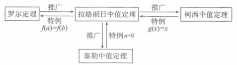
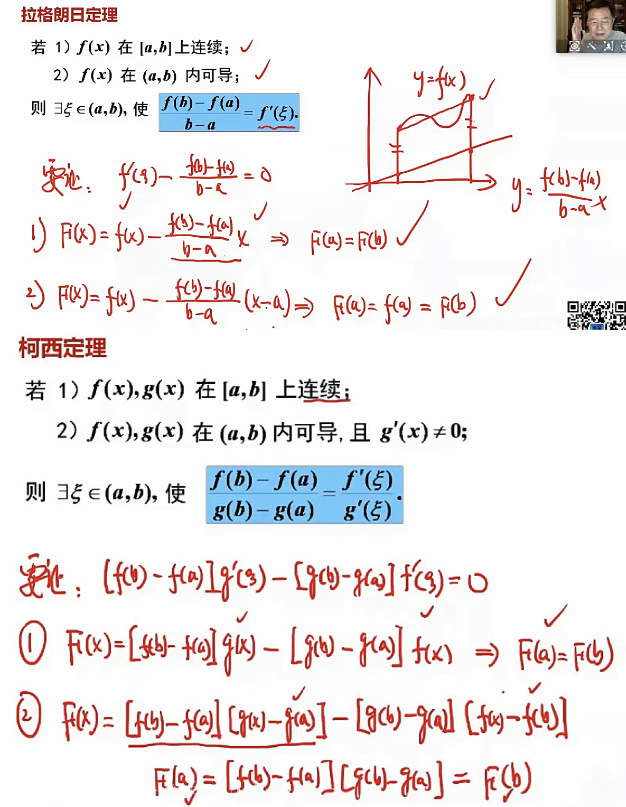
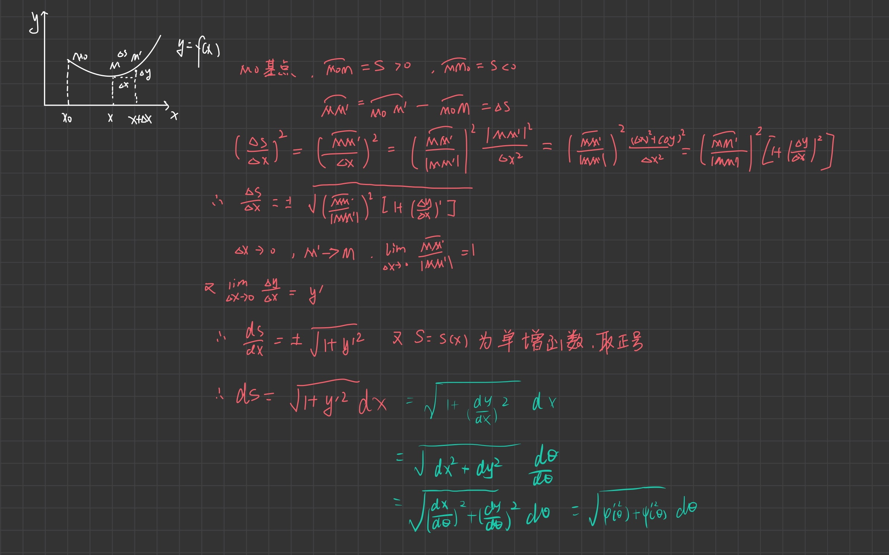
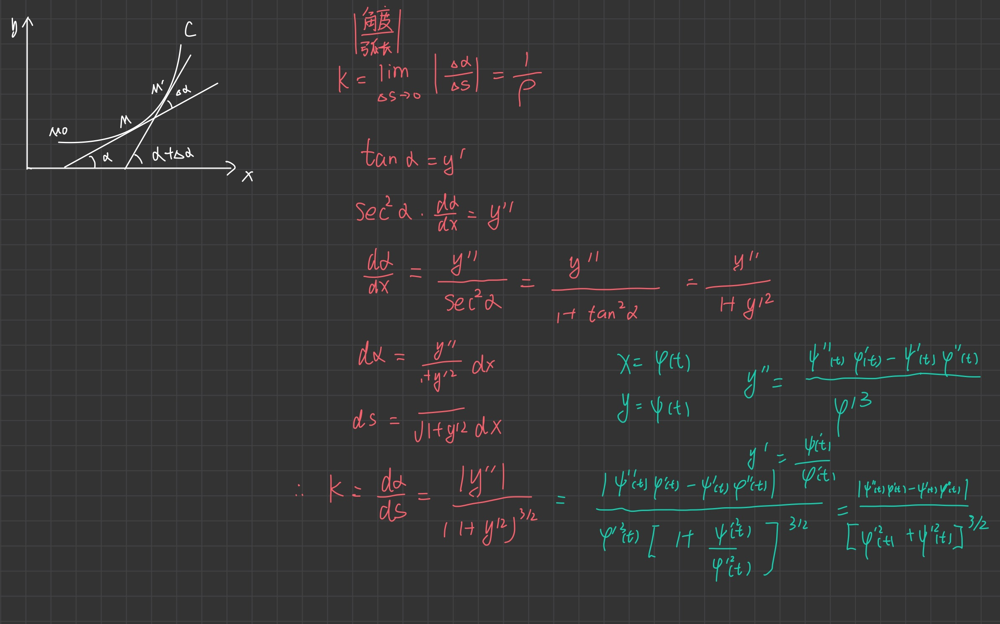
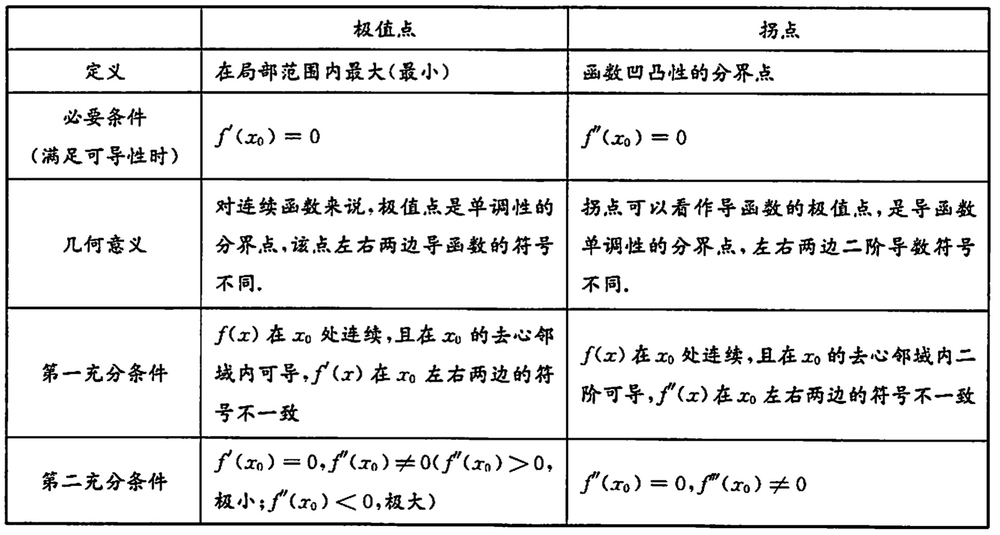

# 第二节 导数应用

## 微分中值定理

> 微分中值定理建立了函数与导数、函数与高阶导数的桥梁，为导数研究函数奠定了理论基础
> 
### 罗尔定理
设$f(x)$在$[a,b]$上连续,在$(a,b)$内可导，且$f(a)=f(b)$,那么至少存在一个$\xi \in (a, b)$，使$f'(\xi)=0$

### 拉格朗日定理
设$f(x)$在$[a,b]$上连续,在$(a,b)$内可导,那么至少存在一个$\xi \in(a,b)$,使$\frac{f(b)-f(a)}{b-a}=f'(\xi)$

### 柯西定理
设$f(x),g(x)$在$[a,b]$上连续,在$(a,b)$内可导,且$g'(x)\not=0$,那么至少存在一个$\xi\in (a, b)$, 使$\frac{f(b)-f(a)}{g(b)-g(a)}=\frac{f'(\xi)}{g'(\xi)}$

### 泰勒定理(拉格朗日余项)
设$f(x)$在区间$I$上$n+1$阶可导，$x_0\in I$,那么$\forall x \in I$,至少存在一个$\xi$使得$f(x)=f(x_0)+\frac{f'(x_0)}{1!}(x-x_0)+\frac{f^{(2)}(x_0)}{2!}(x-x_0)^2+\cdots+\frac{f^{(n)}(x_0)}{n!}(x-x_0)^n+ R_n(x)$.其中$R_n(x)=\frac{f^{(n+1)}(\xi)}{(n+1)!}(x-x_0)^{n+1}, \xi在x_0与x之间$

$\textcolor{red}{注}$
1. 以上四大中值定理，特别是拉格朗日中值定理建立了函数在区间上的变化(改变量)与函数在该区间内一点处导数的关系，从而使我们能够利用导数来研究函数在区间上的整体性态.  
2. 四大中值定理的关系如下:
 

### 证明

## 极值与最值

> 极值点可能是一阶导数为0或不存在的点  
> 若连续函数在定义区间端点处不是最值，则其定义区间内的最值也是极值，该点导数为0，由费马引理可证！
> 

### 1. 极值的概念
$y=f(x)$在点$x_0$的某邻域内有定义，如果对于该去心邻域内任何$x$，恒有$f(x)< f(x_0)$(或$f(x)>f(x_0)$), 则称$x_0$为$f(x)$的一个**极大值点**(或**极小值点**)，称$f(x_0)$为$f(x)$为**极大值**(或**极小值**).极大(小)值统称为**极值**，极大(小)值点统称为**极值点**.

$\textcolor{red}{注}$ 1. 函数在区间$[a,b]$上的极值只能在开区间$(a,b)$上取得；端点$x=a,x=b$处不可能取得极值.  
2. 若函数在闭区间$[a,b]$上的最大值(或最小值)在开区间$(a,b)$上某点取得，那么，函数在该点处必取得极大值(或极小值).

### 2. 极值的必要条件
设$y=f(x)$在点$x_0$处可导，且$x_0$为$f(x)$的极值点，则$f'(x_0)=0$.  
通常把导数为零的点称为函数的**驻点**，由极值的必要性可知，对可导函数而言，极值只可能在驻点上取得，极值点必为驻点，但驻点并不一定是极值点.而对一般函数而言，极值只可能在两种点上取得，这两种点是驻点和导数不存在的点，而要判断在这两种点上是否一定取得极值需利用下列充分条件.

### 3. 极值的充分条件
1. 第一充分条件  
设$f'(x_0)=0$(或$f(x)$在$x_0$处连续),且在$x_0$的某去心邻域$\mathring{U}(x_0,\delta)$内可导.  
	a. 若$x\in(x_0-\delta, x_0)$时，$f'(x)>0$，而$x\in(x_0,x_0+\delta)$时，$f'(x)<0$,则$f(x)$在$x_0$处取得极大值;  
	b. 若$x\in(x_0-\delta, x_0)$时，$f'(x)<0$，而$x\in(x_0,x_0+\delta)$时，$f'(x)>0$,则$f(x)$在$x_0$处取得极小值;  
	c. 若$x\in\mathring{U}(x_0, \delta)$时，$f'(x)$的符号保持不变，则$f(x)$在$x_0$处没有极值.
2. 第二充分条件  
若$f'(x_0)=0,f''(x_0)\not=0$,则$f(x)$在$x_0$处取得极值，其中当$f''(x_0)>0$时取得极小值, 当$f''(x_0)<0$时取得极大值.
3. 第三充分条件  
若$f'(x_0)=f''(x_0)=\cdots=f^{(n-1)}(x_0)\not=0$,则  
当n为偶数时，$f(x)$在$x_0$处有极值，其中$f^{(n)}(x_0)>0$时取得极小值,$f^{(n)}(x_0)<0$取得极大值;  
当n为奇数时，$f(x)$在$x_0$处无极值.

---
$$\begin{aligned} & 极值\textcolor{red}{(局部性态)}第三充分条件的证明,用局部泰勒公式\\
&f(x)-f(x_0)=\frac{f^{n}(x0)}{n!}(x-x_0)^n+o(x-x_0)^n\\
&1.\ n为偶数,(x-x_0)^n>0,则f(x)-f(x_0)>0(<0),根据极值定义,有极值.\\
&2.\ n为奇数,(x-x_0)^n在x_0左右f(x)-f(x_0)异号,无极值.
\end{aligned}$$

### 4. 函数的最值
连续函数$f(x)$在$[a,b]$上的最值的求法:
1. 第一步:求出$f(x)$在开区间$(a,b)$内的驻点和不可导的点$x_1,x_2,\cdots,x_n$;
2. 第二步:求出$f(x)$在点$x_1,x_2,\cdots,x_n$和区间端点a,b处的函数值$f(x_1),f(x_2),\cdots,f(x_n)$
3. 第三步:比较以上各点函数值，其中最大的即为$f(x)$在$[a,b]$上的最大值，最小的即为$f(x)$在$[a,b]$上的最小值.
 
$\textcolor{red}{注}$ 当闭区间$[a,b]$上的连续函数$f(x)$在$(a,b)$内仅有唯一极值点，若在该点$f(x)$取得极大值(或极小值)，则它也是$f(x)$在$[a,b]$上的最大值(或最小值).

## 曲线的凹凸与拐点

### 1. 曲线的凹向
**定义** 设$f(x)$在区间$I$上连续，如果对$I$上任意两点$x_1, x_2$,恒有$f(\frac{x_1+x_2}{2})< \frac{f(x_1)+f(x_2)}{2}$,则称$f(x)$在$I$上的图形是凹的；如果恒有$f(\frac{x_1+x_2}{2})> \frac{f(x_1)+f(x_2)}{2}$,则称$f(x)$在$I$上的图形是凸的.

**判定** 若在区间$I$上$f''(x)>0(<0)$,则曲线$y = f(x)$在$I$上是凹(凸)的.

### 2. 曲线的拐点
**定义** 如果连续曲线$y = f(x)$在点$(x_0,f(x_0))$邻近两侧凹凸性相反，则称点为$(x_0,f(x_0))$曲线$y=f(x)$的**拐点**.

**判定**
1. 必要条件:设$y=f(x)$在点上处$x_0$阶可导，且点$(x_0,f(x_0))$为曲线$y=f(x)$的拐点则$f''(x_0)=0$.
2. 第一充分条件:设$y=f(x)$在点$x_0$的某去心邻域内二阶可导，且$f''(x_0)=0$(或$f(x)$在$x_0$处连续).  
	a. 若$f''(x)$在$x_0$的左、右两侧异号，则点$(x_0, f(x_0))$是曲线$y=f(x)$的拐点;  
	b. 若$f''(x)$在$x_0$的左、右两侧同号,则点$(x_0, f(x_0))$不是曲线$y=f(x)$的拐点.
3. 第二充分条件:设$y=f(x)$在点$x_0$处三阶可导，且$f''(x_0)=0$.  
	a. 若$f'''(x)\not=0$，则点$(x_0, f(x_0))$是曲线$y=f(x)$的拐点;  
	b. 若$f'''(x_0)=0$,则此方法不能判定$(x_0, f(x_0))$是否为曲线$y=f(x)$的拐点.
4. 第三充分条件:若$f''(x_0)=f'''(x_0=\cdots= f^{(n-1)}(x_0)=0$, 但$f^{(n)}(x_0)\not=0(n\ge3)$, 则当n为奇数时，点$(x_0, f(x_0))$是曲线$y=f(x)$的拐点，当n为偶数时，点$(x_0, f(x_0))$不是曲线$y=f(x)$的拐点

$\textcolor{red}{注}$ 将极值点的必要条件和充分条件中的导数阶数提高一阶便是拐点的一个必要条件和三个充分条件

## 曲线的渐近线

### 1. 水平渐近线
若$\lim\limits_{x\to\infty}f(x)=A$(或$\lim\limits_{x\to-\infty}f(x)=A$,或$\lim\limits_{x\to+\infty}f(x)=A$,那么$y=A$是$y=f(x)$的**水平渐近线**.

### 2. 垂直渐近线
若$\lim\limits_{x\to x_0}f(x)=\infty$(或$\lim\limits_{x\to x_0^-}f(x)=\infty$,或$\lim\limits_{x\to x_0^+}f(x)=\infty$,那么$x=x_0$是$y=f(x)$的**垂直渐近线**.

### 3. 斜渐近线
若$\lim\limits_{x\to\infty}\frac{f(x)}{x}=a, \lim\limits_{x\to\infty}(f(x)-ax)=b$(或$x\to-\infty$, 或$x\to+\infty$), 那么$y=ax+b$是$y=f(x)$的**斜渐近线**.

## 平面曲线的曲率
$$\begin{aligned} 
&弧微分\ ds=\sqrt{1+y'^2}dx=\sqrt{\varphi'^2(t)+\psi'^2(t)}dt\\
&曲率圆在\textcolor{red}{曲线凹}的一侧取一点D，使｜DM｜=\rho，以D为圆心，\rho为半径\\
&1.圆心在切点下侧，曲线为凸的\\
&2.圆心在切点上侧，曲线为凹的\end{aligned} $$

### 1. 弧微分

### 2. 曲率的定义
$$K=\lim\limits_{\Delta s\to0}|\frac{\Delta \alpha}{\Delta s}|$$

### 3. 曲率的计算
1. 若曲线由直角坐标方程$y=y(x)$给出，则$K=\frac{|y''|}{(1+y'^2)^{\frac{3}{2}}}$
2. 若曲线由参数方程$\left\{\begin{array}{ll}x=x(t)\\y=y(t)\end{array}\right.$给出，则$K=\frac{|y''x'-y'x''|}{(x'^2+y'^2)^{\frac{3}{2}}}$

### 4. 曲率圆与曲率半径
曲率半径:$R=\frac{1}{K}$

## 题型一、函数的单调性、极值与最值
$F(x)$为偶函数$\Rightarrow f(x)$为奇函数，$f(x)$为奇函数$\Rightarrow F(x)$为偶函数;  
$F(x)$为奇函数$\Rightarrow f(x)$为偶函数，$f(x)$为偶函数$\xRightarrow{F(0)=0} F(x)$为奇函数;  
$F(x)=F(x+T)\Rightarrow f(x)=f(x+T), f(x)=f(x+T)\xRightarrow{\int_0^Tf(x)\mathrm{d}x=0}F(x)=F(x+T)$

$$\begin{aligned} 
& \textcolor{red}{x=x_0是极值点}的三充分条件\\
&1.\ f'(x_0)=0(或f(x)在x_0处连续),f'(x)在\mathring{U}(x_0,\delta)\exists且左右异号\\
&2.\ f'(x_0)=0,f''(x_0) > 0极小值；f''(x_0)<0极大值\\
&3.\ f'(x_0)=f''(x_0)=...=f^{(n-1)}(x_0)=0,n为偶数，f^{(n)}(x_0) > 0极小值；f^{(n)}(x_0)<0极大值\\
& \textcolor{red}{(x_0,f(x_0))是拐点}的三充分条件\\
&1.\ f''(x_0)=0(或f(x)在x_0处连续),f''(x)在\mathring{U}(x_0,\delta)\exists且左右异号\\
&2.\ f''(x_0)=0,f'''(x_0) \not=0是拐点；f'''(x_0)=0无法判断\\
&3.\ f''(x_0)=...=f^{(n-1)}(x_0)=0,f^{(n)}(x_0) \not= 0；n为奇数是，n为偶数则不是\\
\end{aligned} $$

## 题型二、函数的凹凸、拐点、渐近线与曲率

> 水平渐近线可以看作为斜率为0的斜渐近线，即两者不共存
> 

$$求斜渐近线的另一种方法：\lim_{x\to ∞} [f(x)-(ax+b)]=0$$

## 题型三、方程的根的存在性及个数

> 含参数方程根的问题，一般分离常数  
> 用罗尔定理证明的存在性，求原函数（在区域满足罗尔定理条件，则该函数存在零点）  
> 罗尔定理推论很重要，配属至少n个根条件可限定为n个根
> 
### 1. 存在性
方法1：零点定理;  
方法2：罗尔定理。

### 2. 根的个数
方法1：单调性;  
方法2：罗尔定理推论。  
**罗尔定理推论** 若在区间$Ⅰ$上 $f^{(n)}(x)\not=0$，则方程$f(x)=0$在$I$上最多n个实根.

---
**罗尔定理推论证明**  
反证：设$f(x)$至少有$n+1$个根，$f'(x)$有n个零点，$f''(x)$有n-1个,..., $f^{(n)}(x)$有1个零点与$f^{(n)}(x)\not=0$矛盾。

## 题型四、证明函数不等式
- 单调性
- 最大最小值
- 拉格朗日中值定理
- 泰勒公式
- 凹凸性

## 题型五、微分中值定理有关的证明题

> 分析法、逆推法、微分方程法找构造函数  
> 零点定理找其他零点可为罗尔定理服务，积分中值定理也可以！  
> 整体泰勒公式联系高阶导数，如f''(x),f'''(x)...  
> n个点相等，可反复用罗尔定理至n-1处的导数值  
> 微分方程法通解是关于x，y的函数，即z的全微分是F[x,y,y’]  
> 

### (一)证明存在一个点$\xi \in(a, b)$，使$F[\xi, f(\xi), f'(\xi)]=0$	
此类问题的一般方法是将要证结论改写为$F[\xi, f(\xi), f'(\xi)]=0$，然后构造辅助函数用罗尔定理，而构造辅助函数的方法主要有两种:  
1. 分析法(还原法)
根据对欲证的结论$F[\xi, f(\xi), f'(\xi)]=0$的分析，确定辅助函数$g(x)$，使$g'(x)=F[\xi, f(\xi), f'(\xi)]$
2. 微分方程法  
欲证：$F[\xi, f(\xi), f'(\xi)]=0$  
	a. 求微分方程$F(x,y,y')=0$的通解$H(x,y)=C$;  
	b. 设辅助函数:$g(x)= H(x,f(x))$.

$\textcolor{red}{注}$ 归纳出一类常用的辅助函数
1. 欲证$\xi f'(\xi)+nf(\xi)=0$,令$F(x)=x^nf(x)$;
2. 欲证$\xi f'(\xi)-nf(\xi)=0$,令$F(x)=\frac{f(x)}{x^n}$;
3. 欲证$f'(\xi)+\lambda f(\xi)=0$,令$F(x)=e^{\lambda x}f(x)$;  
特别地：  
	1. 欲证$\xi f'(\xi)+f(\xi)=0$,令$F(x)=e^xf(x)$;
	2. 欲证$\xi f'(\xi)-f(\xi)=0$,令$F(x)=e^{-x}f(x)$;
4. 欲证$\alpha f'(\xi)+\beta f(\xi)=0$,令$F(x)=e^{\frac{\beta}{\alpha}x}f(x)(\alpha\not=0)$;
5. 欲证$f'(\xi)+g'(\xi)f(\xi)=0$,令$F(x)=e^{g(x)}f(x)$;
6. 欲证$f'(\xi)+g(\xi)f(\xi)=0$,令$F(x)=e^{\int g(x)\mathrm{d}x}f(x)$;

### (二)证明存在两个中值点$\xi, \eta\in(a, b)$，使$F[\xi, \eta, f(\xi), f(\eta), f'(\xi), f'(\eta)]=0$
**方法：**  
1. 不要求$\xi \not= \eta$:  
在同一区间$[a, b]$上用两次中值定理(拉格朗日、柯西中值定理）
2. 要求$\xi\not=\eta$:  
将区间$[a, b]$分为两个子区间, 在两个子区间上分别用拉格朗日中值定理.

### (三)证明存在一个中值点$\xi\in(a, b)$使$F[\xi, f^{(n)}(\xi)]\ge0(n\ge2)$
用带拉格朗日余项的泰勤公式，共中$x_0$点选题目中提供函数值和导数值信息多的点.
> 另外一个思想 —> 多项式拟合  
> 次数与证明几阶导数相同，条件相同，然后反复用罗尔定理
>
