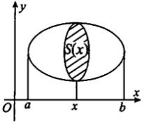

# 第四节 定积分应用

## 几何应用

> 二重积分可以化极坐标形式，方便做题
> 
### 1. 平面图形的面积
计算平面图形的面积时，利用二重积分比利用一元定积分的元素法方便，设有平面域D，则该平面域D的面积为
$$
S=\iint_D 1\mathrm{d}\sigma
$$

1. 若平面域D由曲线$y=f(x), y=g(x)(f(x)\ge g(x))$,$x=a, x=b(a< b)$所围成(如图)，则

$$
S=\iint_D 1\mathrm{d}\sigma=\int_a^b\mathrm{d}x\int_{g(x)}^{f(x)}1\mathrm{d}y=\int_a^b[f(x)-g(x)]\mathrm{d}x
$$
2. 若平面域D由曲线$r=r(\theta), \theta=\alpha, \theta=\beta(\alpha< \beta)$所围成(如图)则其面积为

$$
S=\iint_D 1\mathrm{d}\sigma=\int_{\alpha}^{\beta}\mathrm{d}\theta\int_0^{r(\theta)}r\mathrm{d}r=\frac{1}{2}\int_{\alpha}^{\beta}r^2(\theta)\mathrm{d}\theta
$$

$\textcolor{red}{注}$ 平面域D的面积直接用二重积分$S=\iint_D1\mathrm{d}\sigma$计算, 然后根据积分域D选择计算二重积分的方法(直角坐标、极坐标、奇偶性、对称性)
    
### 2. 空间体的体积
#### 2.1 旋转体的体积
旋转体的体积的一般问题是平面域D绕直线$L:ax+by+c=0$(该直线不穿过区域D,如图)旋转所得旋转体体积,记该体积为V.

解决该问题利用二重积分比利用一元定积分的**元素法**方便.在区域D中取一小区域$(\mathrm{d}\sigma)$,其面积记为$\mathrm{d}\sigma,(x,y)$为区域$(\mathrm{d}\sigma)$中的任一点，则该小区域绕直线L旋转所得环状体的体积近似值为
$$
\mathrm{d}v=2\pi r(x,y)\mathrm{d}\sigma
$$
其中$r(x, y)$为点$(x, y)$到直线L的距离,即$r(x, y) = \frac{|ax+by+c|}{\sqrt{a^2+b^2}}$, 则
$$
V=2\pi \iint_D r(x, y)\mathrm{d}\sigma
$$
特别地，若区域D由曲线$y=f(x)(f(x)\ge0)$和直线$x=a，x=b(0\le a< b)$及x轴所围成(如图),则

1. 区域D绕x轴旋转$(r(x, y) = y)$一周所得旋转体的体积为
$$
V_x=2\pi \iint_D y\mathrm{d}\sigma = 2\pi \int_a^b \mathrm{d}x\int_0^{f(x)}y\mathrm{d}y=2\pi \int_a^b f^2(x)\mathrm{d}x
$$
2. 区域D绕y轴旋转$(r(x, y) = x)$一周所得旋转体的体积为
$$
V_y=2\pi \iint_D x\mathrm{d}\sigma = 2\pi \int_a^b \mathrm{d}x\int_0^{f(x)}x\mathrm{d}y=2\pi \int_a^b xf(x)\mathrm{d}x
$$
$\textcolor{red}{注}$ 平面域D绕直线$L:ax+by+c=0$(该直线不穿过区域D）旋转所得旋转体体积直接用二重积分$V=2\pi\iint_D r(x, y)\mathrm{d}\sigma$计算，然后选择计算二重积分的方法(直角坐标、极坐标、奇偶性、对称性).用这个方法比用一元的元素法简单得多.

#### 2.2 已知横截面面积的体积

$$
V=\int_a^b S(x)\mathrm{d}x
$$

### 3. 曲线弧长
1. 设曲线段C由直角坐标方程$y=y(x)(a\le x\le b)$给出，其中$y(x)$在$[a,b]$上有一阶连续导数，则该曲线段的弧长为
$$
s=\int_a^b \sqrt{1+y'^2}\mathrm{d}x
$$
2. 设曲线段C由参数方程$\left\{\begin{array}{ll}
x=x(t),\\
y=y(t),
\end{array}\right.(\alpha\le t\le \beta)$
给出，其中$x(t),y(t)$在$[\alpha,\beta]$上有一阶连续导数，则该曲线段的弧长为
$$
s=\int_{\alpha}^{\beta}\sqrt{x'^2(t)+y'^2(t)}\mathrm{d}t
$$
3. 设曲线段C由极坐标方程$r=r(\theta)(\alpha\le 0\le β)$给出，其中$r(\theta)$在$[\alpha,\beta]$上有一阶连续导数，则该曲线段的弧长为
$$
s=\int_{\alpha}^{\beta}\sqrt{r^2(\theta)+r'^2{\theta}}\mathrm{d}\theta
$$

### 4. 旋转体侧面积
曲线$y=f(x)(f(x)\ge 0)$和直线$x=a，x=b(0\le a< b)$及文轴所围成区域绕x轴旋转所得旋转体的侧面积为
$$
S=2\pi \int_a^b f(x)\sqrt{1+f'^2(x)}\mathrm{d}x
$$

[[各种线]]

## 物理应用

### 1. 变力沿直线所做的功
$$\begin{aligned}
&功=力•位移（W=F\ •\ s）\\
&1.\; dW=dF\;•\;s\\
&\quad dF=\rho gdV\\
&\quad dW=\textcolor{red}{s}\ •\ ρg\ dV\qquad \textcolor{red}{s}是位移\\
&2.\; dW=F\;•\;ds
\end{aligned}$$
    
### 2. 液体的压力
$$\begin{aligned} & 
压力=压强•面积（P=p\ •\ A）\\
&压强 p=\textcolor{red}{h}\rho g\qquad \textcolor{red}{h}是深度\\
&dP=p\ •\ dA\\
&dA=l\ •\ dx
\end{aligned} $$

### 3. 引力
### 4. 形心
$$\begin{aligned}
&形心：\bar{x}=\frac{\iint_D{x}\mathrm{d}\sigma}{\iint_D{1}\mathrm{d}\sigma}\\
&质心：\bar{x}=\frac{\int{x\rho(x)}\mathrm{d}x}{\int{\rho(x)}\mathrm{d}x} \qquad \bar{x}=\frac{\iint_D{x\rho(x,y)}\mathrm{d}\sigma}{\iint_D{\rho(x,y)}\mathrm{d}\sigma}
\end{aligned} $$

## 题型一 几何应用
1. 曲线$y=f(x)$与x轴,直线$x=\alpha$和$x=b$组成的平面区域D的面积为$S=\int_a^b |f(x)|\mathrm{d}x$, 平面区域D绕x轴旋转所成的旋转休的体积$V=\int_a^b \pi[f(x)]^2\mathrm{d}x$
2. 在极坐标下，曲线$r=\rho (\theta)$与射线$\theta=\alpha$和$\theta=\beta$所围成的平面区域的面积$S=\frac{1}{2}\int_{\alpha}^{\beta}[\rho(\theta)]^2\mathrm{d}\theta$.如果曲线$r=\rho(\theta)$本身是闭合的,则一般不会给出上下限$\alpha$和$\beta$,这种时候可以通过求解不等式$\rho(\theta)\ge 0$求出$\theta$的范围.
3. (数一、数二)曲线弧长的计算中,弧长微分公式 $ds =\sqrt{[x'(t)]^2+[y'(t)]^2+[z'(t)]^2} \mathrm{d}t$是基本,其它公式都可以看作它的推论,对于数一的考生来说,掌握这个公式还是后面正确理解曲线积分的基础.

## 题型二 物理应用
