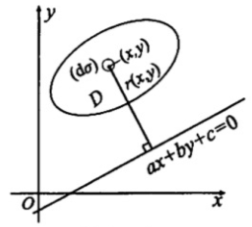
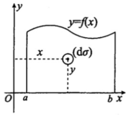

### 空间体的体积

#### 1. 旋转体的体积

旋转体的体积的一般问题是平面域D绕直线$L:ax+by+c=0$(该直线不穿过区域D,如图)旋转所得旋转体体积,记该体积为V.

解决该问题利用二重积分比利用一元定积分的**元素法**方便.在区域D中取一小区域$(\mathrm{d}\sigma)$,其面积记为$\mathrm{d}\sigma,(x,y)$为区域$(\mathrm{d}\sigma)$中的任一点,则该小区域绕直线L旋转所得环状体的体积近似值为

$$
\mathrm{d}v=2\pi r(x,y)\mathrm{d}\sigma
$$

其中$r(x, y)$为点$(x, y)$到直线L的距离,即$r(x, y) = \frac{|ax+by+c|}{\sqrt{a^2+b^2}}$, 则

$$
V=2\pi \iint_D r(x, y)\mathrm{d}\sigma
$$

特别地,若区域D由曲线$y=f(x)(f(x)\geqslant0)$和直线$x=a,x=b(0\leqslant a< b)$及x轴所围成(如图),则

1. 区域D绕x轴旋转$(r(x, y) = y)$一周所得旋转体的体积为

$$
V_x=2\pi \iint_D y\mathrm{d}\sigma = 2\pi \int_a^b \mathrm{d}x\int_0^{f(x)}y\mathrm{d}y=\pi \int_a^b f^2(x)\mathrm{d}x
$$

2. 区域D绕y轴旋转$(r(x, y) = x)$一周所得旋转体的体积为

$$
V_y=2\pi \iint_D x\mathrm{d}\sigma = 2\pi \int_a^b \mathrm{d}x\int_0^{f(x)}x\mathrm{d}y=2\pi \int_a^b xf(x)\mathrm{d}x
$$

$\textcolor{red}{注}$ 平面域D绕直线$L:ax+by+c=0$(该直线不穿过区域D)旋转所得旋转体体积直接用二重积分$V=2\pi\iint_D r(x, y)\mathrm{d}\sigma$计算,然后选择计算二重积分的方法(直角坐标、极坐标、奇偶性、对称性).用这个方法比用一元的元素法简单得多.

#### 2. 已知横截面面积的体积

$$
V=\int_a^b S(x)\mathrm{d}x
$$
