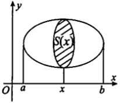

### 空间体的体积

#### 1. 旋转体的体积

**古尔丁定理**

![[Pasted image 20240726171947.png]]

上半平面内一个有界闭区域D绕x轴旋转而成的旋转体的体积等于该区域的形心所经过的路程与D的面积A的乘积

$$
V=2\pi \iint_D y\mathrm{d}\sigma= A 2\pi \frac{1}{A} \iint_D y\mathrm{d}\sigma = A \cdot 2\pi \bar{y}
$$
##### 一般区域绕一般直线旋转

旋转体的体积的一般问题是平面域D绕直线$L:ax+by+c=0$(该直线不穿过区域D,如图)旋转所得旋转体体积,记该体积为V.

解决该问题利用二重积分比利用一元定积分的**元素法**方便.在区域D中取一小区域$(\mathrm{d}\sigma)$,其面积记为$\mathrm{d}\sigma,(x,y)$为区域$(\mathrm{d}\sigma)$中的任一点,则该小区域绕直线L旋转所得环状体的体积近似值为

$$
\mathrm{d}v=2\pi r(x,y)\mathrm{d}\sigma
$$

其中$r(x, y)$为点$(x, y)$到直线L的距离,即$r(x, y) = \frac{|ax+by+c|}{\sqrt{a^2+b^2}}$, 则

$$
V=2\pi \iint_D r(x, y)\mathrm{d}\sigma
$$

**区域绕坐标轴旋转的体积**

1. x型区域绕x轴旋转

![[Pasted image 20240726164357.png]]

$$
V_x
= 2\pi \iint_D R(x,y)\mathrm{d}\sigma \\
= 2\pi \iint_D y\mathrm{d}\sigma 
= 2\pi \int_a^b \mathrm{d}x\int_{g(x)}^{f(x)}y\mathrm{d}y=\pi \int_a^b [f^2(x)-g^2(x)]\mathrm{d}x
$$

2. y型区域绕y轴旋转

![[Pasted image 20240726165604.png]]

$$
V_y
= 2\pi \iint_D r(x,y)\mathrm{d}\sigma 
= 2\pi \iint_D x\mathrm{d}\sigma 
= 2\pi \int_a^b \mathrm{d}y\int_{g(y)}^{f(y)}x\mathrm{d}x
= \pi \int_a^b [f^2(y)-g^2(y)]\mathrm{d}y \qquad (圆盘法)
$$
3.  x型区域绕y轴旋转

![[Pasted image 20240726170947.png]]
$$
V_y
= 2\pi \iint_D r(x,y)\mathrm{d}\sigma 
= 2\pi \iint_D x\mathrm{d}\sigma 
= 2\pi \int_a^b \mathrm{d}x\int_{g(x)}^{f(x)}x\mathrm{d}y
= 2\pi \int_a^b x[f(x)-g(x)]\mathrm{d}x \qquad (柱壳法)
$$
![[Accessory/Pasted image 20240723094229.png]]

$\textcolor{red}{注}$ 平面域D绕直线$L:ax+by+c=0$(该直线不穿过区域D)旋转所得旋转体体积直接用二重积分$V=2\pi\iint_D r(x, y)\mathrm{d}\sigma$计算,然后选择计算二重积分的方法(直角坐标、极坐标、奇偶性、对称性).用这个方法比用一元的元素法简单得多.

#### 2. 已知横截面面积的空间体体积

$$
V=\int_a^b S(x)\mathrm{d}x
$$

https://zhuanlan.zhihu.com/p/68613567 

https://mp.weixin.qq.com/s?__biz=MzI0Nzc5MTc2MQ==&mid=2247507295&idx=1&sn=2d2d5f10cfd04e1605ea4ec142da2d02&chksm=e9a834a1dedfbdb7a8d651bec97715c5e26bee78817853510a01b7e8444822afdab167646a42&scene=27