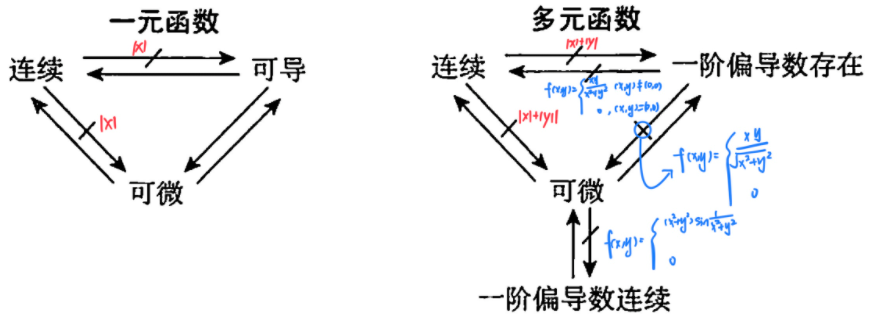

# 第一节 重极限、连续、偏导数、全微分(概念、理论)

## 一、重极限

**定义** 设函数$f(x,y)$在区域D上有定义,点$P_0(x_0,y_0)\in D$为D的*聚点*,如果$V_{\epsilon}＞0$,存在$\delta> 0$,当$P(x,y)\in D$,且$0< \sqrt{(x-x_0)^2+(y-y_0)^2}< \delta$占时,都有
$$|f(x,y)-A|< \epsilon$$
成立,则称常数$A$为函数$f(x,y)$当$(x,y)\to (x_0, y_0)时的极限,记为 
$$\begin{aligned}
\lim\limits_{(x, y)\to(x_0, y_0)}f(x, y)=A或\lim_{\substack{x\to x_0 \\ y\to y_0}}f(x, y)=A或\lim\limits_{P\to P_0}f(P)=A
\end{aligned}$$

$\textcolor{red}{注}$  
1. 这里的极限是要求点$(x, y)$在D内以任意方式趋近于点$(x_0, y_0)$时,函数$f(x,y)$都趋近于同一确定的常数A,否则该极限就不存在.
2. 一元函数极限中的下述性质对多元函数仍成立  
	a. 局部有界性
	b. 保号性
	c. 有理运算
	d. 极限与无穷小的关系
	e. 夹逼性

> 求重极限,取绝对值用夹逼
> 

$\textcolor{red}{注}$ 求重极限常用方法
1. 利用极限性质(四则运算法则,夹逼原理);
2. 消去分母中极限为零的因子(有理化,等价无穷小代换);
3. 利用无穷小量与有界变量之积为无穷小量.

## 二、连续

**定义** 若$\lim\limits_{\substack{x\to x_0\\y\to y_0}}f(x, y)=f(x_0, y_0)$, 则称$f(x, y)$在点$(x_0, y_0)$处连续.

### 性质
1. 连续函数的和、差、积、商(分母不为零)及复合仍连续;
2. 基本初等函数在其定义域内连续,初等函数在其定义区域内连续;
3. 有界闭区域上连续函数的性质:  
	a. 有界性:若$f(x,y)$在有界闭区域D上连续,则f(x,y)在D上有界.  
	b. 最值性:若$f(x,y)$在有界闭区域D上连续,则f(x,力在D上必有最大值和最小值.  
	c. 介值性:若$f(x,y)$在有界闭区域D上连续,则f(x,y)在D上可取到介于最小值与 最大值之间的任何值． 

## 三、偏导数

### 1. 定义
$$\begin{aligned}
&f'_x(x_0, y_0)=\lim\limits_{\Delta x\to 0}\frac{f(x_0+\Delta x, y_0)-f(x_0, y_0)}{\Delta x}=\frac{f(x, y_0)}{\mathrm{d}x}\bigg|_{x=x_0}\\
&f'_y(x_0, y_0)=\lim\limits_{\Delta y\to 0}\frac{f(x_0, y_0+\Delta y)-f(x_0, y_0)}{\Delta y}=\frac{f(x_0, y)}{\mathrm{d}y}\bigg|_{y=y_0}
\end{aligned}$$

$\textcolor{red}{注}$ $f'_x(x_0, y_0)$就是一元函数$f(x, y_0)$在$x_0$处的导数;
$f'_y(x_0, y_0)$就是一元函数$f(x_0, y)$在$y_0$处的导数.

### 2. 几何意义

$f'_x(x_0, y_0)$表示曲线$z=f(x,y_0)$在点$(x_0, y_0, f(x_0, y_0))$处的切线对x轴的斜率;  
$f'_y(x_0, y_0$表示曲线$z=f(x_0, y_0)$在点$(x_0, y_0, f(x_0, y_0))$处的切线对y轴的斜率.
    
### 3. 高阶偏导数
设$z=f(x, y)$, 则:
$$\begin{aligned}
&\frac{\partial^2 z}{\partial x^2}=f''_{xx}(x, y)=\frac{\partial}{\partial x}\bigg(\frac{\partial z}{\partial x}\bigg), \qquad \frac{\partial^2 z}{\partial x \partial y}=f''_{xy}(x, y)=\frac{\partial}{\partial y}\bigg(\frac{\partial z}{\partial x}\bigg)\\
&\frac{\partial^2 z}{\partial y \partial x}=f''_{yx}(x, y)=\frac{\partial}{\partial y}\bigg(\frac{\partial z}{\partial y}\bigg),\qquad \frac{\partial^2 z}{\partial y^2}=f''_{yy}(x, y)=\frac{\partial}{\partial y}\bigg(\frac{\partial z}{\partial y}\bigg). 
\end{aligned}$$

**定理** 如果函数$z=f(x, y)$的两个二阶混合偏导数$f''_{xy}(x, y)$及$f''_{yx}(x, y)$在区域D内连续,则在区域D内恒有
$$
f''_{xy}(x, y)=f''_{yx}(x, y)
$$

## 四、全微分

### 1. 定义
> 等价4:在(0,0)点,A=B=0可推导出可微
> 
若$\Delta z=f(x_0+\Delta x, y_0+\Delta y)-f(x_0, y_0)=A\Delta x+ B\Delta y+o(\rho)$, 则称函数$z=f(x, y)$在点$(x_0, y_0)$可微, $A\Delta x+B\Delta y$成为函数$z=f(x, y)$在点$(x_0, y_0)$的**全微分**,记为
$$\mathrm{d}z=A\Delta x+B\Delta y$$

$\textcolor{red}{注}$ 以下四条等价
$$\begin{aligned}
&(1) \Delta z= f(x_0+ \Delta x, y_0+\Delta y)-f(x_0, y_0)=A\Delta x+ B\Delta y+o(\rho)\\
&(2) \lim_{\substack{\Delta x\to 0\\ \Delta y\to 0}}\frac{[f(x_0+\Delta x, y_0+\Delta y)-f(x_0, y_0)]-[A\Delta x+B\Delta y]}{\sqrt{(\Delta x)^2+(\Delta y)^2}}=0\\
&(3) \Delta z= f(x, y)-f(x_0, y_0)=A(x-x_0)+ B(y-y_0)+o(\rho)\\
&(4) \lim_{\substack{x\to x_0\\ y\to y_0}}\frac{[f(x, y)-f(x_0, y_0)]-[A(x-x_0)+B(y-y_0)]}{\sqrt{(x-x_0)^2+(y-y_0)^2}}=0\\
\end{aligned}$$

它们是函数$f(x,y)$在$(x_0, y_0)$处可微的等价形式,由它们都可得到$f(x,y)$在点$(x_0, y_0)$处可微,且$f'_x(x_0, y_0)=A, f'_y(x_0, y_0)=B$

### 2. 可微性判定
$$\begin{aligned}
&(1)必要条件:f'_{x}(x_0, y_0)与f'_{y}(x_{0}, y_{0})都存在;\\
&(2)充分条件:f'_{x}(x,y)和f'_{y}(x,y)在(x_0, y_{0})连续,\\ 
&(3)用定义判定: \\
&\qquad 1.f'_{x}(x_0, y_0)与f'_{y}{x_0, y_0}是否都存在?\\
&\qquad 2.\lim_{\substack{\Delta x\to 0\\ \Delta y \to 0}}\frac{[f(x_0+\Delta x, y_0+\Delta y)-f(x_0, y_0)]-[f'_{x}(x_0, y_0)\Delta x+f'_{y}(x_0, y_0)\Delta y]}{\sqrt{(\Delta x)^2+(\Delta y)^2}}是否为零?
\end{aligned}$$

### 3. 计算
若$f(x, y)$可微, 则$\mathrm{d}z=\frac{\partial f}{\partial x}\mathrm{d}x+\frac{\partial f}{\partial y}\mathrm{d}y$

## 五、连续、可导、可微的关系
> 不连续一定不可微
> 

## 题型一 讨论连续性、可导性、可微性
