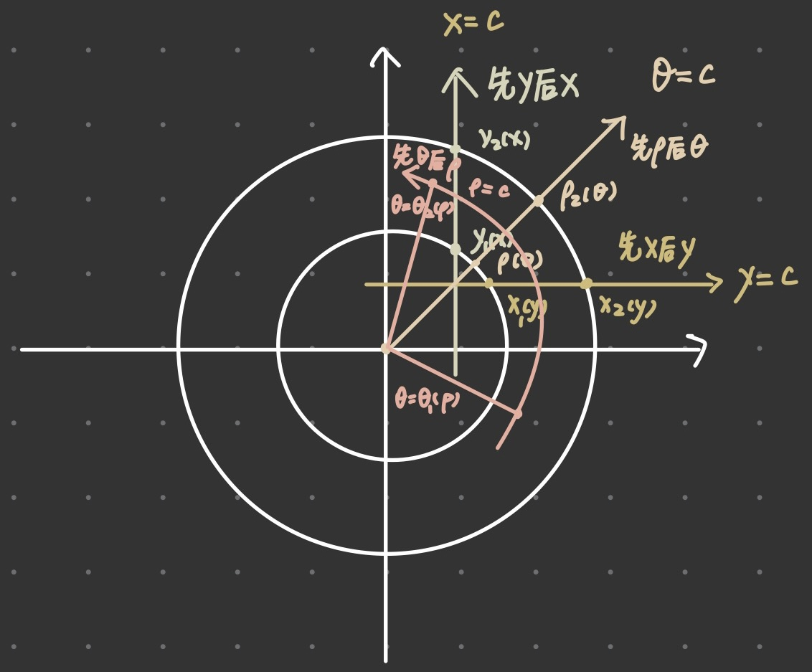

# 二重积分

## 二重积分的概念
**定义** 函数$z = f(x,y)$在有界闭区域D上有界，将D任意分成n个小闭区域
$$\Delta \sigma_1, \Delta \sigma_2, \cdots, \Delta \sigma_n$$
其中$\Delta \sigma_i$表示第i个小区域，也表示它的面积．在每个$\Delta \sigma_i$上任取一点$(\xi_i, \eta_i)$，作乘积$f(\xi_i, \eta_i)\Delta \sigma_i$，并求和$\sum\limits_{i=1}^{n}f(\xi_i, \eta_i)$.记$\lambda$为n个小区域$\Delta \sigma_1, \Delta \sigma_2, \cdots, \Delta \sigma_n$中的最大直径，如果$\lim\limits_{\lambda\to 0}\sum\limits_{i=1}^{n}f(\xi_i, \eta_i)\Delta\sigma_i$存在，则称此极限值为函数$f(x, y)$在区域D上的**二重积分**, 己为 
$$\iint\limits_D f(x, y)\mathrm{d}\sigma=\lim\limits_{\lambda\to 0}\sum\limits_{i=1}^{n}f(\xi, \eta_i)\Delta\sigma_i$$

## 二重积分的几何意义
二重积分$\iint_D f(x, y)\mathrm{d}\sigma$是一个数.当$f(x,y)\ge 0$时,其值等干以积分域D为底, 以曲面$z=f(x,y)$为曲顶的曲顶柱体的体积.

| 形状 | 体积                 | 表面积                              |
| ---  | ---                  | ---                                 |
| 球体 | $\frac{4}{3}\pi r^3$ | $4\pi r^2$                          |
| 圆锥 | $\frac{1}{3}\pi r^3$ | $\pi r^2 +\pi rl(l=\sqrt{r^2+h^2})$ |

## 二重积分的性质
### 1. 不等式性质
1. 若在D上$f(x, y)\le g(x, y)$，则$\iint\limits_D f(x, y)\mathrm{d}\sigma\le \iint\limits_D g(x, y)\mathrm{d}\sigma$.
2. 若$f(x, y)$在D上连续，则$mS\le \iint\limits_D f(x, y)\mathrm{d}\sigma\le MS$, 其中m和M分别为$f(x, y)$在上的最小值和最大值，S为积分域D的面积． 
3. $\bigg| \iint\limits_D f(x, y)\mathrm{d}\sigma \bigg| \le \iint\limits_D |f(x, y)|\mathrm{d}\sigma$

### 2. 积分中值定理
若$f(x, y)$在D上连续，则$\iint\limits_D f(x, y)\mathrm{d}\sigma = f(\xi, \eta)S$，其中$(\xi, \eta)\in D$, S为积分域D的面积． 

### 3. 区域可加性

## 二重积分的计算

### 1. 利用直角坐标计算
#### 1.1 先y后x  
若积分域D是X型区域，即积分域D可以用不等式$y_1(x)\le y\le y_2(x)$来表示, 则
$$\iint\limits_Df(x, y)\mathrm{d}\sigma=\int_a^b\mathrm{d}x\int_{y_1(x)}^{y_2(x)}f(x, y)\mathrm{d}y$$

#### 1.2 先x后y
若积分域D是Y型区域，即积分域D可以用不等式$x_1(y)\le x\le x_2(y), c\le y\le d$来表示, 则
$$\iint\limits_Df(x, y)\mathrm{d}\sigma=\int_c^d\mathrm{d}y\int_{x_1(y)}^{x_2(y)}f(x, y)\mathrm{d}x$$

### 2. 利用极坐标计算
> 注意先θ后ρ有时也很方便
> 

#### 2.1 先$r$后$\theta$  
若积分域D可以用不等式$r_1(\theta)\le r \le r_2(\theta), \alpha\le\theta\le\beta$来表示, 则
$$\iint\limits_Df(x, y)\mathrm{d}\sigma=\int_{\alpha}^{\beta}\mathrm{d}\theta\int_{r_1(\theta)}^{r_2(\theta)}f(r\cos \theta, r\sin \theta)r\mathrm{d}r$$

$\textcolor{red}{注}$ 适合用极坐标计算的二重积分的特征  
1. 适合用极坐标计算的被积函数:
$$f(\sqrt{x^2+y^2}), f(\frac{y}{x}), f(\frac{x}{y})$$
2. 适合用极坐标的积分域:
$$x^2+y^2\le R^2; r^2\le x^2+y^2 \le R^2; x^2+y^2\le 2ax; x^2+y^2\le 2by$$
- 圆心既不在坐标原点，也不在坐标轴上，则平移加极坐标
 
### 3. 利用对称性和奇偶性计算
> y轴可以看作x=0；x轴看作y=0
> 

1. 若积分域D关于y轴(直线x=0)对称, $f(x, y)$关于x有奇偶性, 则:
$$\begin{aligned}
\iint\limits_Df(x, y)\mathrm{d}\sigma=\left\{\begin{array}{ll}
2\iint\limits_{D_x\ge 0}f(x, y)\mathrm{d}\sigma, &\qquad f(-x, y)=f(x, y)\\
0, &\qquad f(-x, y)=-f(x, y)
\end{array}\right.
\end{aligned}$$
2. 若积分域D关于x轴(直线y=0)对称, $f(x, y)$关于y有奇偶性, 则:
$$
\iint\limits_Df(x, y)\mathrm{d}\sigma=\left\{\begin{array}{ll}
2\iint\limits_{D_y \ge 0}f(x, y)\mathrm{d}\sigma, &\qquad f(x, -y)=f(x, y)\\
0, &\qquad f(x, -y)=-f(x, y)
\end{array}\right.$$

### 4. 利用变量对称性计算
二重积分$\iint\limits_Df(x, y)\mathrm{d}\sigma$积分域D是点$(x, y)$的集合，记为$D_{(x, y)}$, 类似一元定积分的值与积分变量用什么记号无关，则
$$\iint\limits_{D_{(x, y)}}f(x, y)\mathrm{d}\sigma = \iint\limits_{D_(y, x)}f(x, y)\mathrm{d}\sigma$$
即把二重积分的被积函数$f(x,y)$及积分域$D_{(x, y)}$中的x和y对调, 积分值不变.例如, 
$$\iint\limits_{x^2+2y^2\le 1}(3x^2+4y^2)\mathrm{d}\sigma=\iint\limits_{y^2+2x^2\le 1}(3y^2+4x^2)\mathrm{d}\sigma$$
如果积分域D关于直线$y=x$对称，即$(x, y)\in D \Leftrightarrow (y, x)\in D$, 此时$D_{(x, y)}=D_{(y, x)}$则,  
$$\iint\limits_{D}f(x, y)\mathrm{d}\sigma=\iint\limits_D f(y, x)\mathrm{d}\sigma$$
即当积分域D关于直线$y=x$对称时，将被积函数$f(x,y)$中的x和y对调，积分值不变． 

### 5. 交换积分次序

## 题型一 计算二重积分

- 圆域跨一四象限，用负角
- 交换积分次序
- 偏心圆用平移加极坐标算
- 奇偶性的平移
- 任何二重积分把积分域、被积函数中x、y统统对调，值不变

$$\begin{aligned}&
质心：\overline{x}=\frac{\iint\limits_D x\rho(x,y)d\sigma}{\iint\rho(x,y)d\sigma}\\
&形心：\overline{x}=\frac{\iint\limits_D xd\sigma}{S_D}\\
&\int_{-∞}^{+∞}e^{-t^2}dt=\sqrt{\pi}
\end{aligned} $$

## 题型二 累次积分交换次序及计算

- 直角坐标下交换次序，从小到大符号不变；从大到小变号
- 先y后x；看x=c的射线
- 先x后y；看y=c的射线
- 先ρ后θ；看θ=c的射线
- 先θ后ρ；看ρ=c的圆弧线

## 题型三 与二重积分有关的综合题

## 题型四 与二重积分有关的积分不等式问题

- 分部积分法
- 拉格朗日
- 一重乘积形式，化二重积分；积分域一般为正方形，利用轮换对称性，写二分之一做
