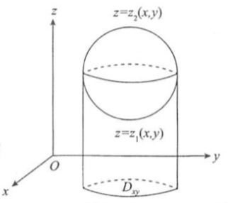
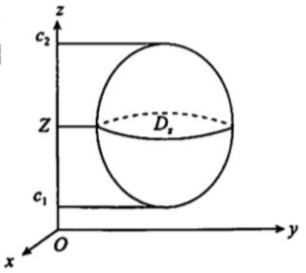

# 第一节 三重积分与线面积分

## 三重积分
### 1. 定义
$$\iiint\limits_{\varOmega}f(x, y, z)\mathrm{d}v=\lim\limits_{d\to 0}\sum\limits_{k=1}^{n}f(\xi_k, \eta_k, \zeta_k)\Delta v_k$$

### 2. 性质
1. 不等式性质
2. 积分中值定理

### 3. 计算
> 被积域是球域，被积函数可代入：线面、积分；不可代：二重、三重积分
> 

#### 3.1 直角坐标
##### 先一后二(先单后重)
设平行于z且穿过闭区域口内部的直线与口的边界曲面S最多两个交点.$\varOmega$在$xOy$面上的投影域为$D_{xy}$(如图), 则

$$\iiint\limits_{\varOmega}f(x, y, z)\mathrm{d}v=\iint\limits_{D_{xy}}\mathrm{d}\sigma\int_{z_1(x, y)}^{z_2(x, y)}f(x, y, z)\mathrm{d}z$$

##### 先二后一(先重后单)
设空间区域$\varOmega=\{(x, y, z)|(x, y)\in D_z, c_1\le z\le c_2\}$, 其中$D_z$是垂直于z轴的平面截闭区域$\varOmega$所得的平面闭区域(如图), 则

$$\iiint\limits_{\varOmega}f(x, y, z)\mathrm{d}v=\int_{c_1}^{c_2}\mathrm{d}z\iint\limits_{D_z}f(x, y, z)\mathrm{d}x\mathrm{d}y$$

#### 3.2 柱坐标
柱坐标与直角坐标的关系为 
$$\begin{cases}
x=r\cos \theta, \qquad 0\le r < +\infty\\
y=r\sin \theta, \qquad 0\le \theta \le 2\pi\\
z=z, \qquad -\infty\le z\le +\infty
\end{cases}$$
**体积微元** $\mathrm{d}v = r\mathrm{d}r\mathrm{d}\theta\mathrm{d}z$  
$$\iiint\limits_{\varOmega}f(x, y, z)\mathrm{d}v=\iiint\limits_{\varOmega}f(r\cos \theta, r\sin \theta, z)r\mathrm{d}r\mathrm{d}\theta\mathrm{d}z$$

#### 3.3 球坐标
球坐标与直角坐标的关系为 
$$\begin{cases}
x=r\sin \varphi\cos \theta, &\qquad 0\le r < +\infty\\
y=r\sin \varphi\sin \theta, &\qquad 0\le \varphi \le \pi\\
z=r\cos \varphi, &\qquad 0\le \theta \le 2\pi
\end{cases}$$
**体积微元** $\mathrm{d}v=r^2\sin\varphi \mathrm{d}r \mathrm{d}\varphi \mathrm{d}\theta$
$$\iiint\limits_{\varOmega}f(x, y, z)\mathrm{d}v=\iiint\limits_{\varOmega}f(r\sin \varphi\cos \theta, r\sin \varphi\sin \theta, r\cos\varphi)r^2\sin\varphi \mathrm{d}r \mathrm{d}\varphi \mathrm{d}\theta$$

#### 3.4 利用奇偶性
若积分域口关于$xOy$坐标面对称, $f(x, y, z)$关于$z$有奇偶性, 则 
$$
\iiint\limits_{\varOmega} f(x, y, z)\mathrm{d}v=\begin{cases}
2\iiint\limits_{\varOmega_z\ge 0}f(x, y, z)\mathrm{d}v, &\qquad f(x, y, z)关于z是偶函数\\
0, &\qquad f(x, y, z)关于z是奇函数
\end{cases}$$
$\textcolor{red}{注}$ 若积分域关于$xOz$或$yOz$坐标面对称有相应结论.

#### 3.5 利用变量的对称性

## 对弧长的线积分（第一类线积分）
### 1. 定义
$$\int_L f(x, y)\mathrm{d}s = \lim\limits_{\lambda\to 0}\sum\limits_{i=1}^{n}f(\xi_i, \eta_i)\Delta s_i$$

### 2. 性质
$$\int_{L(\overgroup{AB})}f(x, y)\mathrm{d}s=\int_{L(\overgroup{BA})}f(x, y)\mathrm{d}s \quad (与积分路径方向无关)$$

### 3. 计算（平面）
#### 3.1 直接法
1. 若$L:\begin{cases}x=x(t)\\y=y(t)\end{cases}(\alpha\le t\le \beta)$, 则 
$$\int_L f(x y)\mathrm{d}s=\int_{\alpha}^{\beta}f(x(t), y(t))\sqrt{x'^2(t)+y'^2(t)}\mathrm{d}t$$
2. 若$L:y=y(x)(\alpha\le x\le b)$, 则
$$\int_L f(x, y)\mathrm{d}s=\int_a^b f(x, y(x))\sqrt{1+y'^2(x)}\mathrm{d}x$$
3. 若$L:r=r(\theta)(\alpha\le \theta\le \beta)$, 则
$$\int_L f(x, y)\mathrm{d}s=\int_{\alpha}^{\beta}f(r\cos \theta, r\sin \theta)\sqrt{r^2+r'^2}\mathrm{d}\theta$$

#### 3.2 利用奇偶性
1. 若积分曲线$L$关于$y(x=0)$轴对称, 则
$$\int_L f(x, y)\mathrm{d}s=\begin{cases}
2\int_{L:x\ge 0}f(x, y)\mathrm{d}s, &\qquad 当f(x, y)关于x为偶函数\\
0, &\qquad 当f(x, y)关于x为奇函数\end{cases}
$$
2. 若积分曲线$L$关于$x(y=0)轴对称, 则 
$$\int_L f(x, y)\mathrm{d}s=\begin{cases}
2\int_{L:y\ge 0}f(x, y)\mathrm{d}s, &\qquad 当f(x, y)关于y为偶函数\\
0, &\qquad 当f(x, y)关于y为奇函数\end{cases}
$$

#### 3.3 利用对称性
若积分曲线关于直线$y=x$对称, 则$\int_L f(x, y)\mathrm{d}s=\int_L f(y, x)\mathrm{d}s$. 特别地$\int_L f(x)\mathrm{d}s=\int_L f(y)\mathrm{d}s$.  

对空间曲线积分$\int_L f(x, y, z)\mathrm{d}s$, 通常化为定积分计算, 即  
若曲线$L$的方程为:$x=x(t), y=y(t), z=z(t)\quad (\alpha\le t\le \beta)$, 则
$$\int_L f(x, y, z)\mathrm{d}s=\int_{\alpha}^{\beta}f(x(t), y(t), z(t))\sqrt{x'^2(t)+y'^2(t)+z'^2(t)}\mathrm{d}t$$

## 对坐标的线积分（第二类线积分）
### 1. 定义
$$\int_L P(x, y)\mathrm{d}x+Q(x, y)\mathrm{d}y=\lim\limits_{\lambda\to 0}\sum\limits_{i=1}^n [P(\xi_i, \eta_i)\Delta x_i+Q(\xi_i, \eta_i)\Delta y_i]$$
### 2. 性质
$$\int_{L(\overgroup{AB})}P\mathrm{d}x+Q\mathrm{d}y = -\int_{L(\overgroup(BA))}P\mathrm{d}x+Q\mathrm{d}y \quad (与积分路径方向有关)$$

### 3. 计算方法（平面）
#### 3.1 直接法 
设有光滑曲线$L:\begin{cases}x=x(t)\\y=y(t)\end{cases}t\in[\alpha, \beta]$, 其起点和终点分别对应参数$t=\alpha$和$t=\beta, P(x, y), Q(x, y)$在$L$上连续, 则
$$\int_L P\mathrm{d}x+Q\mathrm{d}y=\int_{\alpha}^{\beta}[P(x(t), y(t))x'(t)+Q(x(t), y(t))y'(t)]\mathrm{d}t$$

#### 3.2 格林公式
设闭区域D由分段光滑的曲线L围成, 函数$P(x, y), Q(x, y)$在D上具有一阶连续偏导数, 则有
$$\oint_L P\mathrm{d}x+Q\mathrm{d}y=\iint\limits_D(\frac{\partial Q}{\partial x}-\frac{\partial P}{\partial y})\mathrm{d}\sigma$$
其中L为D取正向的边界曲线.

#### 3.3 补线用格林公式 

#### 3.4 利用线积分与路径无关 
##### 线积分与路径无关的判定
**定理** 设函数$P(x, y), Q(x, y)$在**单连通域**$D$上有一阶连续偏导数, 则以下四条等价:
$$\begin{aligned}
&1) 线积分\int_L P\mathrm{d}x+Q\mathrm{d}y与路径无关;\\
&2) \oint_L P\mathrm{d}x+Q\mathrm{d}y=0, 其中L为D中任一分段光滑闭曲线;\\
&3) \frac{\partial P}{\partial y}=\frac{\partial Q}{\partial x}, \forall (x, y)\in D\\
&4) P(x, y)\mathrm{d}x+Q(x, y)\mathrm{d}y=\mathrm{d}F(x, y)\\
\end{aligned}$$

##### 计算
###### 改换路径计算
一般是沿平行于坐标轴的直线积分, 即
$$\begin{aligned}
&\int_{(x_1, y_1)}^{(x_2, y_2)}P\mathrm{d}x+Q\mathrm{d}y=\int_{x_1}^{x_2}P(x, y_1)\mathrm{d}x+\int_{y_1}^{y_2}Q(x_2, y)\mathrm{d}y\\
或
&\int_{(x_1, y_1)}^{(x_2, y_2)}P\mathrm{d}x+Q\mathrm{d}y=\int_{y_1}^{y_2}P(x_1, y)\mathrm{d}y+\int_{x_1}^{x_2}Q(x, y_2)\mathrm{d}x
\end{aligned}$$

###### 利用原函数计算
设$P\mathrm{d}x+Q\mathrm{d}y=\mathrm{d}F(x, y)$, 即$F(x,y)$为$P\mathrm{d}x+Q\mathrm{d}y$的原函数, 则
$$\int_{(x_1, y_1)}^{(x_2, y_2)}P\mathrm{d}x+Q\mathrm{d}y=F(x_2, y_2)-F(x_1, y_1)$$

求原函数方法:
1. 偏积分
2. 凑微分

---

$$\footnotesize L是否闭合\left \{ \begin{array}{ll}是\Rightarrow 格林公式\\[5mm] 否 \Rightarrow 是否与路径无关 \left \{ \begin{array}{ll} 是 \left \{ \begin{array}{ll} 改换路径计算 \\[4mm]利用原函数计算  \end{array}\right. \\[10mm] 否 \left \{ \begin{array}{ll} 补线用格林公式\\[4mm] 直接计算\end{array}\right. \end{array}\right. \end{array}\right. $$

### 4. 两类积分的联系
$$\oint_L P\mathrm{d}x+Q\mathrm{d}y=\oint_L (P\cos \alpha +Q\cos \beta)\mathrm{d}s$$

> 两个cos是曲线的切线向量的方向余弦
> 

### 5. 计算方法（空间）
#### 5.1 直接法
设分段光滑的曲线$L$由参数方程$x=x(t), y=y(t), z=z(t), t\in [\alpha, \beta]$给出, 其起点和终点分别对应参数$t=\alpha$和$t=\beta, P, Q, R$在$L$上连续, 则 
$$\begin{aligned}
&\int_L P(x, y, z)\mathrm{d}x+Q(x, y, z)\mathrm{d}y+R(x, y, z)\mathrm{d}z =\\
&\int_{\alpha}^{\beta}\{P[x(t), y(t), z(t)]x'(t)+Q[x(t), y(t), z(t)]y'(t)+R[x(t), y(t), z(t)]z'(t)\}\mathrm{d}t.
\end{aligned}$$

#### 5.2 斯托克斯公式
设$L$为空间分段光滑的有向闭曲线, $\varSigma$是以$L$为边界的分片光滑曲面, $L$的方向与$\varSigma$的法方向符合右手法则, 函数$P, Q, R$在$\varSigma$上具有一阶连续偏导数, 则有 
$$\begin{aligned}
&\oint_L P(x, y, z)\mathrm{d}x+Q(x, y, z)\mathrm{d}y+ R(x, y, z)\mathrm{d}z\\
&=\iint\limits_{\varSigma}
\begin{vmatrix}
\cos \alpha & \cos \beta & \cos \gamma\\
\frac{\partial}{\partial x} & \frac{\partial}{\partial y} & \frac{\partial}{\partial z}\\
P & Q & R
\end{vmatrix}\mathrm{d}S\\
&=\iint_{\varSigma}(\frac{\partial R}{\partial y}-\frac{\partial Q}{\partial z})\mathrm{d}y\mathrm{d}z+
(\frac{\partial P}{\partial z}-\frac{\partial R}{\partial x})\mathrm{d}z\mathrm{d}x+
(\frac{\partial Q}{\partial x}-\frac{\partial P}{\partial y})\mathrm{d}x\mathrm{d}y
\end{aligned}$$

> 三个cos是曲面的法线向量的方向余弦
> 

## 对面积的面积分（第一类面积分）

### 1. 定义
$$\iint\limits_{\varSigma}f(x, y, z)\mathrm{d}S=\lim\limits_{\lambda\to 0}\sum\limits_{i=1}^{n}f(\xi_i, \eta_i, \zeta_i)\Delta S_i$$

### 2. 性质
$$\iint\limits_{\varSigma}f(x, y, z)\mathrm{d}S=\iint\limits_{-\varSigma}f(x, y, z)\mathrm{d}S \quad (与积分曲面的方向无关)$$

### 3. 计算
#### 3.1 直接法
设曲面$\varSigma:z=z(x, y), (x, y)\in D_{xy}$, 则 
$$\iint\limits_{\varSigma}f(x, y, z)\mathrm{d}S=\iint\limits_{D_{xy}}f[x, y, z(x, y)]\sqrt{1+z'^2_x+z'^2_y}\mathrm{d}x\mathrm{d}y$$
若曲面由方程$x=x(y, z)$或$y=y(z, x)$给出, 也可类似地把对面积的面积分化为相应 
的二重积分.

#### 3.2 利用奇偶性 
若曲面$\varSigma$关于$xOy(z=0)$面对称, 则 
$$
\iint\limits_{\varSigma}f(x, y, z)\mathrm{d}S=
\begin{cases}
2\iint\limits_{\varSigma_{z\ge 0}}f(x, y, z)\mathrm{d}S, &\qquad 当f(x, y, z)关于z为偶函数\\
0, &\qquad 当f(x, y, z)关于z为奇函数\\
\end{cases}
$$

#### 3.3 利用对称性

## 对坐标的面积分（第二类面积分）

### 1. 定义
$$\iint\limits_{\varSigma}R(x, y, z)\mathrm{d}x\mathrm{d}y=\lim\limits_{\lambda\to 0}\sum\limits_{i=1}^{n}R(\xi_i, \eta_i, \zeta_i)(\Delta S_i)_{xy}$$

### 2. 性质
$$\iint\limits_{\varSigma}P\mathrm{d}y\mathrm{d}z+Q\mathrm{d}z\mathrm{d}x+R\mathrm{d}x\mathrm{d}y=-\iint\limits_{-\varSigma}P\mathrm{d}y\mathrm{d}z+Q\mathrm{d}z\mathrm{d}x+R\mathrm{d}x\mathrm{d}y(与积分曲面的方向有关)$$

### 3. 计算
#### 3.1 直接法
1. 设有向曲面$\varSigma:z=z(x, y), (x, y)\in D_{xy}$, 则 
$$\iint\limits_{\varSigma}R(x, y, z)\mathrm{d}x\mathrm{d}y=\pm \iint\limits_{D_{xy}}R[x, y, z(x, y)]\mathrm{d}x\mathrm{d}y$$
若有向曲面$\varSigma$的法线向量与z轴正向夹角为锐角, 即曲面的上侧, 上式中取正号, 否则取负号;  
2. 设有向曲面$\varSigma:x=x(y, z), (y, z)\in D_{yz}$, 则 
$$\iint\limits_{\varSigma}P(x, y, z)\mathrm{d}y\mathrm{d}z=\pm \iint\limits_{D_{yz}}P[x(y, z), y, z]\mathrm{d}y\mathrm{d}z$$
若有向曲面$\varSigma$的法线向量与x轴正向夹角为锐角, 即曲面的前侧, 上式中取正号, 否则取负号;  
3. 设有向曲面$\varSigma:y=y(z, x), (z, x)\in D_{zx}$, 则 
$$\iint\limits_{\varSigma}Q(x, y, z)\mathrm{d}z\mathrm{d}x=\pm \iint\limits_{D_{zx}}Q[x, y(z, x), z]\mathrm{d}z\mathrm{d}x$$
若有向曲面$\varSigma$的法线向量与y轴正向夹角为锐角, 即曲面的右侧, 上式中取正号, 否则取负号.

#### 3.2 高斯公式
设空间闭区域$\varOmega$由分片光滑闭曲面$\varSigma$所围成, 函数$P(x,y,z),Q(x,y,z), R(x,y,z)$在$\varOmega$上具有一阶连续偏导数, 则有 
$$\oiint\limits_{\Sigma_外}P\mathrm{d}y\mathrm{d}z+Q\mathrm{d}z\mathrm{d}x+R\mathrm{d}x\mathrm{d}y=\iiint\limits_{\varOmega}(\frac{\partial P}{\partial x}+\frac{\partial Q}{\partial y}+\frac{\partial R}{\partial z})\mathrm{d}v$$

#### 3.3 补面用高斯公式 

<aside>
💡 “奇倍偶零”！直接法中，对称曲面前后对称，上下对称，左右对称，对被积函数来说投影域相等，但正负取值不同，偶函数则消去，奇函数则翻倍！
</aside>

### 4. 两类面积分的联系
$$\begin{aligned}
&\iint\limits_{\varSigma}(P\cos \alpha+ Q\cos \beta+ R\cos \gamma)\mathrm{d}S=\iint\limits_{\varSigma}(P\mathrm{d}y\mathrm{d}z+Q\mathrm{d}z\mathrm{d}x+R\mathrm{d}x\mathrm{d}y)\\
&\frac{dydz}{cos \alpha } =\frac{dzdx}{cos \beta } =\frac{dxdz}{cos \gamma }
\end{aligned} $$

## 题型一 计算三重积分
1. 直角坐标(先一后二或先二后一)
2. 柱坐标
3. 球坐标
4. 奇偶性
5. 变量对称性

## 题型二 更换三重积分次序
这里常见的是两种问题, 一种是累次积分交换次序, 另一种是计算累次积分, 计算累次积分通常也是通过交换累次积分次序来进行.交换三重累次积分次序本应像二重累次积分一样, 先画域, 然后再重新定限, 然而, 这里画域往往比较困难, 通常利用二重积分交换次序逐步实现三重累次积分交换次序. 

$$\bf 降维$$

## 题型三 计算对弧长的线积分
常用方法:
1. 平面线线积分
	1. 直接法
	2. 奇偶性
	3. 对称性
2. 空间线积分
	1. 直接法
	2. 变量对称性

## 题型四 计算对坐标的线积分

<aside>
💡 使用格林公式时，需要注意条件，即封闭曲线所围闭区域内P，Q都有一阶连续偏导数！若存在瑕点，可取一小包函瑕点的简单封闭曲线（根据分母来设），可使被积函数去瑕，再用格林公式！！！
</aside>

常用方法:
1. 平面线线积分
	1. 直接法
	2. 格林公式
	3. 补线用格林公式
	4. 利用线积分与路径无关
2. 空间线积分
	1. 直接法
	2. 斯托克斯公式

$\textcolor{red}{注}$ 对线积分$\int_L\frac{y\mathrm{d}x-x\mathrm{d}y}{x^2+y^2}, P=\frac{y}{x^2+y^2}, Q=\frac{-x}{x^2+y^2}$, 除原点(0, 0), $P, Q$有连续一阶偏导数, 且$\frac{\partial P}{\partial y} \equiv \frac{\partial Q}{\partial x}, (x, y)\not= (0, 0)$. 此时有以下结论:
1. 沿任何一条不包含原点在内的分段光滑闭曲线的积分为零.
2. 沿任何一条包含原点在内的分段光滑闭曲线的积分均相等． 

**小结**  
1. 当曲线为闭合曲线时, 可以考虑利用格林公式将曲线积分转化为二重积分来计算.
2. 当积分曲线$L$不闭合时, 也可以利用格林公式计算.  
	方法如下:作有向曲线$L^*$(一般来说要比简单)使得$L+L^*$闭合, 设它们围成的区域为D, 则由格林公式得$\oint\limits_{L+L^*}P\mathrm{d}x+Q\mathrm{d}y=\iint\limits_{D}\frac{\partial Q}{\partial x}-\frac{\partial P}{\partial y}\mathrm{d}x\mathrm{d}y$, 则有
$$\int\limits_L P\mathrm{d}x+Q\mathrm{d}y=\iint\limits_{D}\frac{\partial Q}{\partial x}-\frac{\partial P}{\partial y}\mathrm{d}x\mathrm{d}y-\int_{L^{*}}P\mathrm{d}x+Q\mathrm{d}y$$
3. 当积分曲线L闭合, 但被积函数在$L$做围成的平面区域上有不连续点时, 可以这样计算:  
作有向闭合曲线$L^*$(一般来说要比$L$简单)使得在$L$与$L^*$所围成的区域上被积函数有连续的偏导数, 设它们围成的区域为D, 则由格林公式得$\oint\limits_{L+L^*}P\mathrm{d}x+Q\mathrm{d}y=\iint\limits_{D}\frac{\partial Q}{\partial x}-\frac{\partial P}{\partial y}\mathrm{d}x\mathrm{d}y$, 则有
$$\oint\limits_{L}P\mathrm{d}x+Q\mathrm{d}y=\iint\limits_{D}\frac{\partial Q}{\partial x}-\frac{\partial P}{\partial y}\mathrm{d}x\mathrm{d}y-\oint\limits_{L^*}P\mathrm{d}x+Q\mathrm{d}y$$

## 题型五 计算对面积的面积分
三重积分的先二后一中，投影区间为Dz（是关于z的函数）；而在对面积的面积分中，投影为Dxy（z=0后仅关于x与y）

常用方法
1. 直接法
2. 奇偶性
3. 变量对称性

## 题型六 计算对坐标的面积分
常用方法
1. 直接法
2. 高斯公式
3. 补面用高斯公式

$$\bf 二型化一型$$
