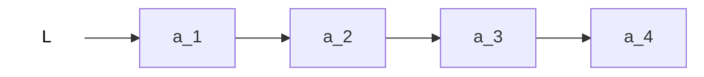

# 单链表的插入

## 按位序插入(带头结点)

`ListInsert(&L,i,e)`: 插入操作, 在表L中的第i个位置上插入指定元素e.

```c
// 在表L中的第i个位置上插入指定元素e.
bool ListInsert(LinkList &L, int i, ElemTyep e){
	if(i<1) return false;

	// LNode *p = GetElem(L, i-1)
	LNode *p; //指针p指向当前扫描到的结点
	int j=0; //当前p指向的是第几个结点
	p = L; //LinkList &L表头指针L指向头结点, 头结点是第0个结点(不存数据)
	while (p!=NULL && j<i-1){ //循环找到第 i-1 个结点
		p=p->next;//指针p指向当前扫描到的结点
		j++
	}
	// LNode *p = GetElem(L, i-1)

	//在p结点之后插入元素e
	if(p==NULL) return false; //i值不合法
	LNode *s = (LNode*)malloc(sizeof(LNode));
	s->data = e;
	s->next=p->next; //将结点连接的原第i个结点
	p->next=s; //将结点连到p之后
	return true;
}
```

> 后插操作

最好时间复杂度: O(1);
平均时间复杂度: O(n)

## 按位序插入(不带头结点)



> 不存在 "第0个"结点, 因此 i=1 时需要特殊处理.

```c
bool ListInsert(LinkList &L, int i, ElemTyep e){
	if(i<1) return false;
	if(i==1){ //插入第一个结点的操作与其他结点操作不同
		LNode *s = (LNode*)malloc(sizeof(LNode));
		s->data = e;
		s->next=L;
		L=s; //头指针指向新结点
		return true;
	}
	LNode *p; // 指针p指向当前扫描到的结点
	int j=1; //当前p指向的是第几个结点
	p = L; //p指向第1个结点
	while (p!=NULL && j<i-1){ //循环找到第 i-1 个结点
		p=p->next;
		j++
	}

	//在p结点之后插入元素e
	// InsertNextNode(p, e) 封装下述代码
	if(p==NULL) return false; //i值不合法
	LNode *s = (LNode*)malloc(sizeof(LNode));
	s->data = e;
	s->next=p->next; //将结点连接的原第i个结点
	p->next=s; //将结点连到p之后
	return true;
}
```

时间复杂度: O(n)

## 指定结点的后插操作

将上述代码中插入语句封装成函数

```c
//后插操作: 在p结点之后插入元素e
bool InsertNextNode (LNode *p, ElemTyep e){
	if(p==NULL) return false; //i值不合法
	LNode *s = (LNode*)malloc(sizeof(LNode));
	if (s==NULL) return false; //内存分配失败
	s->data = e;
	s->next=p->next; //将结点连接的原第i个结点
	p->next=s; //将结点连到p之后
	return true;
}
```

时间复杂度: O(1)

## 指定结点的前插操作

```c
//前插操作: 在p结点之前插入元素e
bool InsertPriorNode(LNode *p, ElemTyep e){
	if(p==NULL) return false; //i值不合法
	LNode *s = (LNode*)malloc(sizeof(LNode));
	if (s==NULL) return false; //内存分配失败
	s->next=p->next; //将s连接p的下个结点
	p->next=s; //将s结点连到p之后
	s->data=p->data;//将p中元素复制到s中
	p->data=e; //p中元素覆盖为e
	return true;
}
```

> 后插一个结点, 交换其与前继结点"内容".

时间复杂度: O(1)
