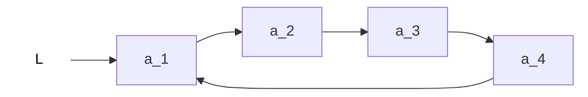

# 循环链表

## 1. 循环单链表

```c
typedef struct LNode{ //定义单链表结点类型
	ElemTyte data; //数据域
	struct LNode *next; //地址域, 指向下个结点
}LNode, *LinkList;

// 初始化一个循环单链表
bool InitList(LinkList &L) {
	L= (LNode *) malloc(sizeof(LNode)); //分配一个头结点
	if (L==NULL) return false; //内存不足分配失败
	L->next = L; //头结点指向头结点
	return true;
}
//判断单链表是否为空
bool Empty(LinkList L){
	if (L -> next == L) return true;
	else return false;
}

//判断结点p是否为循环链表的表尾结点
bool isTail(LinkList L, LNode *p){
	if (p->next == L) return true;
	else return false;
}
```


单链表:从一个结点出发只能找到后续的各个结点.



循环单链表:从一个结点出发可以找到其他任何一个结点.

从头结点找到尾部, 时间复杂度为O(n);从尾部找到头部, 时间复杂度为O(1).

## 2. 循环双链表

```c
typedef struct DNode{ //定义双链表结点类型
	ElemTyte data; //数据域
	struct DNode *prior, *next; //地址域, 指向上个、下个结点
}DNode, *DLinkList;

// 初始化一个循环双链表
bool InitDLinkList(DLinkList &L) {
	L= (DNode *) malloc(sizeof(DNode)); //分配一个头结点
	if (L==NULL) return false; //内存不足分配失败
	L->prior = L; //头结点的prior指向头结点
	L->next = L; //头结点的next指向头结点
	return true;
}
//判断循环链表是否为空
bool Empty(DLinkList L){
	if (L -> next == L) return true;
	else return false;
}

//判断结点p是否为循环链表的表尾结点
bool isTail(DLinkList L, DNode *p){
	if (p->next == L) return true;
	else return false;
}

void testDLinkList(){
	//初始化循环双链表
	DLinkList L;
	InitDLinkList;
	//... other code ...
}
```

### 循环双链表的插入和删除

```c
//在p结点之后插入s结点
bool InsertNextDNode(DNode *p, DNode *s){
	s->next=p->next;
	p->next->prior=s;
	s->prior=p;
	p->next=s;
}

//删除p的后继
bool DeleteNextDNode(DNode *p){
	DNode *q = p->next; //找到p的后继q
  p->next=q->next;
	q->next->prior=p;
	free(q); //释放结点空间
	return true;
}
```
