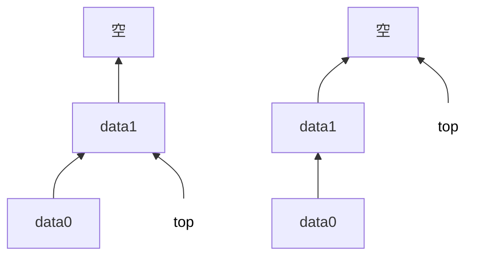

# 顺序栈

## 顺序栈的定义

顺序存储:给各个数据元素分配连续的存储空间, 大小为`MaxSize*sizeof(ElemType)`.

- 采⽤顺序存储的栈
- 利⽤⼀组地址连续的存储单元存放⾃栈底到栈顶的数据元素

```c
#define MaxSize 10 //定义栈中元素的最大个数
typedef structf{
	ElemType data [MaxSize]; //静态数组存放栈中元素
	int top; //栈顶指针
} SqStack;
```

> Sq: sequence, 顺序

顺序栈的缺点:栈的大小不可变

## 顺序栈的初始化

```c
void InitStack(SqStack &S){
	S.top = -1; //初始化栈顶指针
}
```

## 判断栈空

```c
bool StackEmpty(SqStack S){
	if(S.top == -1) return true; //栈空
	else return false; //不空
}
```

## 进栈

```c
bool Push(SqStack &S, ElemType x){
	if(S.top == MaxSize-1) return false; //栈满, 报错

	S.top= S.top +1; //栈顶指针先加1
	S.data[S.top] = x; //新元素入栈

	// 等价写法: S.data[++S.top]= x;

	return true;
}
```

## 出栈

```c
bool Pop(SqStack &S, ElemType &x){
	if(S.top == -1) return false; //栈空, 报错

	x=S.data[S.top];
	S.top=S.top -1;

	return true;
	// 等价写法: x= S.data[S.top--];
}
```

> 数据还残留在内存中, 只是逻辑上被删除了.

## 读栈顶元素

```c
bool GetTop(SqStack S, ElemType &x){
	if(S.top == -1) return false; //栈空, 报错

	x=S.data[S.top]; //x记录栈顶元素

	return true;
}
```

## 另一种实现方向: 栈顶指针初始化为0



上述`S.top`始终指向栈顶元素, 若栈顶元素初始化为`S.top = 0`, 则top指向*栈顶元素的下一个位置*.

发生以下变化:

- 判空: `S.top == 0`
- 进栈: `S.data[S.top++]=x`, 先进栈, 再指向
- 出栈: `x=S.date[--S.top]`, 先指向, 在出栈

## 共享栈

![[Pasted image 20250810190648.png]]

定义

- 利⽤栈底位置相对不变的特性, 可让两个顺序栈共享⼀个⼀维数组空间
- 将两个栈的栈底分别设置在共享空间的两端, 两个栈顶向共享空间的中间延伸

特点

- `top0 = -1` 时, 0号栈为空; `top1 = MaxSize`时, 1号栈为空.
- `top0+ 1==top1`时, 栈满
- 0号栈进栈, `top0`先加1, 再赋值; 1号栈进栈, `top1`先减1, 再赋值.

⽬的

- 更有效地利⽤存储空间
- 两个栈的空间相互调节, 只有在整个存储空间都被占满时才发⽣上溢

```c
#define MaxSize 10//定义栈中元素的最大个数
typedef struct{
	ElemType data [MaxSize]; //静态数组存放栈中元素
	int top0; //0号栈浅顶指针
	int top1; //1号栈浅顶指针
} ShStack;

//初始化栈
void InitStack(ShStack &S){
	S.top0=-1; //初始化栈顶指针
	S.top1=MaxSize;
}
```
