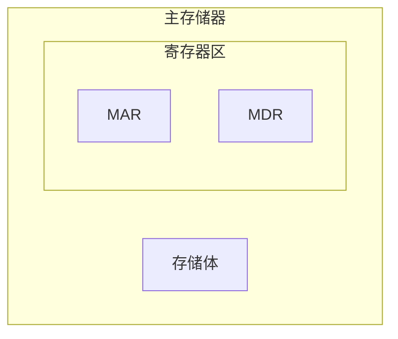

# 计算机硬件

## 1. 存储器

分为: 主存储器(内存)、辅助存储器(硬盘).

工作方式: 按存储单元的地址进行存取(**按地址存取方式**).

![[Pasted image 20250816043801.png]]

- **MAR(Memory Address Register,存储地址寄存器)**:用于寻址, 位数=存储单元的个数/地址码的长度[现代计算机的CPU中也内置了MAR]
- **MDR(Memory Data Register, 存储数据寄存器)**:用于暂存数据, 位数=存储字长
- 存储体: 数据在存储体内按地址存储

一些术语:

- **存储元**:即存储⼆进制的电⼦元件, 每个存储元可存1bit
- **存储单元**:每个存储单元存放一串二进制代码
- **存储字(word)**:存储单元中二进制代码的组合
- 存储字长:存储单元中二进制代码的位数
- 机器字长:计算机能一次处理的二进制代码长度
- 指令字长:指令的二进制长度
- 数据字长:数据总线一次能并行传送信息的次数
- 时序控制逻辑:用于产生存储器操作所需的各种时序信号

例:

- MAR=4位 : 总共有 24 个存储单元
- MDR=16位 : 每个存储单元可存放16bit,
- 1个字(word) = 16bit
- 1个字节(Byte)= 8bit
- 1B=1个字节, 1b=1个bit

> 现代计算机以"存储器"为中心

## 2. 运算器

![[Pasted image 20250816044154.png]]

运算器:用于实现算术运算(如:加减乘除)、逻辑运算(如:与或非)

- **ACC(Accumulator)**: 累加器, 用于存放操作数, 或运算结果.
- **MQ(Mutiple-Quotient Register)**: 乘商寄存器, 在乘、除运算时, 用于存放操作数或运算结果.
- **X**: 通用的操作数寄存器, 用于存放操作数
- **ALU(Arithmetic and Logic Unit)**: 算术逻辑单元, 通过内部复杂的电路实现算数运算、逻辑运算

## 3. 控制器

![[Pasted image 20250816044440.png]]

- **CU(Control Unit)**:控制单元, 分析指令, 给出控制信号
- **IR(Instruction Register)**:指令寄存器, 存放当前执行的指令
- **PC(Program Counter)**:程序计数器, 存放下一条指令地址, 有自动加1功能

## 冯诺伊曼结构的模型机

![[Pasted image 20250816044655.png]]

