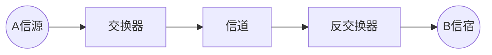

# 编码与调制

- 有线网络适配器(编码-解码器)

**变换器**: 将二进制数据转换为信号.

**反变换器**: 将信号转换为二进制数据.

- 光猫(optical modem): (调制-解调器)

## 常用的编码方式

![[Pasted image 20250809225225.png]]

- **不归零编码(NRZ)** : 低0高1, 中不变
- **归零编码(RZ)** : 低0高1, 中归零
- **反向非归零编码(NRZI)** : 跳0不跳1看起点, 中不变
- **曼彻斯特编码** : 跳0反跳1看中间, 中必变
  1. 上跳0下跳1(常用)
  2. 下跳0上跳1
- **差分曼彻斯特编码** : 跳0不跳1看起点, 中必变

![[Pasted image 20250809225732.png]]

